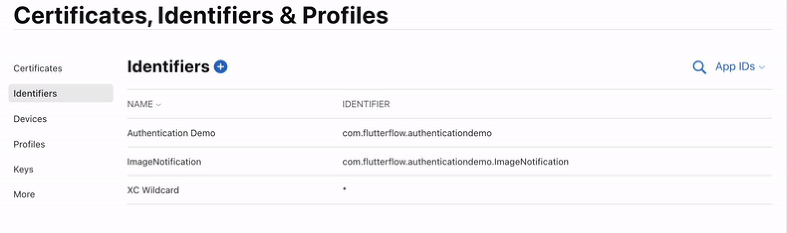

# Enable Push Notifications for iOS Devices

This guide outlines the steps required to ensure push notifications work correctly on iOS devices.

:::info[Prerequisites]
- A registered Apple Developer account
- An app integrated with Firebase
- A real iOS device for testing (not a simulator)
:::

:::warning
Push notifications will **not** work in the following situations:

- The app is running on an iOS simulator.
- The user is not logged in to the app.
- The app is currently open on the device.
:::

Follow the steps below to enable push Notifications for iOS Devices:

1. **Create an APNs Authentication Key in Apple Developer Account**

    To send push notifications to iOS devices, Apple requires an APNs key.

        1. Log in to your **[Apple Developer Account](https://developer.apple.com/account)**.
        2. Navigate to **Certificates, Identifiers & Profiles > Keys**.
        3. If no push key is listed, create one.

        

        :::tip
        Make sure to download the `.p8` file and note your **Key ID** and **Team ID** after generating the key.
        :::
2. **Upload the APNs Key to Firebase**

    1. Go to your **[Firebase Console](https://console.firebase.google.com/)** and open your project.
    2. Navigate to **Project Settings > Cloud Messaging**.
    3. Scroll to the **iOS app configuration** section.
    4. If no APNs key is listed, upload the `.p8` file you downloaded earlier.

    

    :::tip
    This step connects your Firebase backend to Apple’s notification system.
    :::

3. **Add a Push Notification Identifier**

    1. Log back in to your **[Apple Developer Account](https://developer.apple.com/account)**.
    2. Navigate to **Certificates, Identifiers & Profiles > Identifiers**.
    3. Select your app’s identifier.
    4. Enable the **Push Notifications** capability.

    

    If this step is skipped, push notifications will not be delivered to iOS devices after deployment.

4. **Refresh Your FlutterFlow Workspace**

    To ensure your environment reflects the latest settings:

        - Press `Ctrl + R` (Windows) or `Cmd + R` (Mac) to refresh the FlutterFlow editor.
        - Clear your browser cache.
        - Log out and log back in.

:::note
- Ensure your app permissions for notifications are enabled under **iOS Settings > Notifications**.
- Always test push notifications on a **real device** after deployment.
- Ensure that Firebase Cloud Messaging is correctly set up and linked to your project.
:::