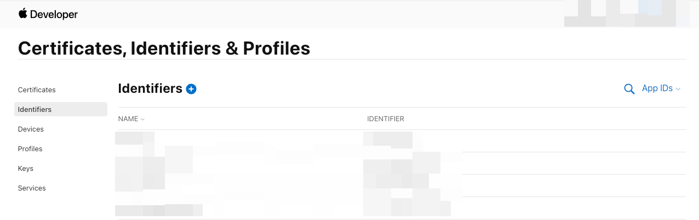
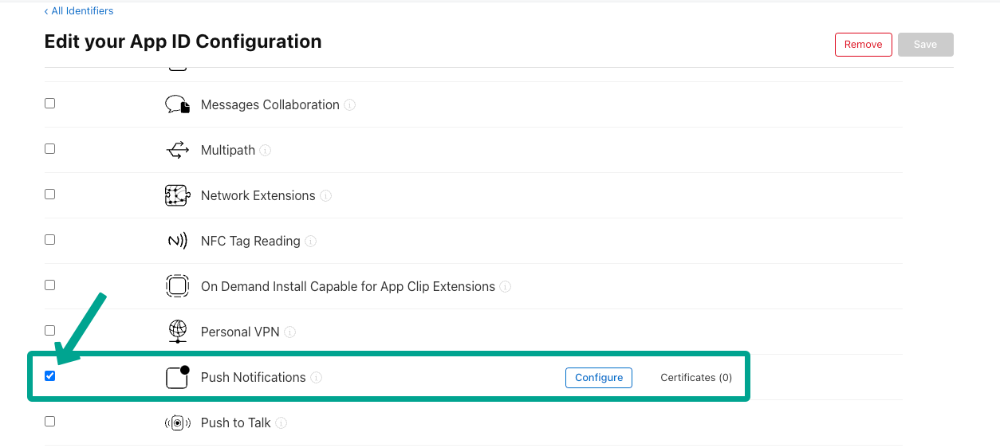

# Enable Push Notifications in Provisioning Profile

When deploying an app to the App Store using FlutterFlow, you may encounter the following error:

   ```text
   Provisioning profile doesn't support the Push Notifications capability.
   ```

This issue indicates that push notifications have not been properly enabled in the provisioning profile associated with your App ID.

:::info[Prerequisites]
An active Apple Developer account and an App ID registered for your app in the Apple Developer Portal.
:::

This error occurs when an app includes push notification functionality, but the **Push Notifications** capability is not enabled in the corresponding App ID within your Apple Developer account.


Follow the steps below to enable the **Push Notifications** capability for your app:

1. **Log into Apple Developer Account**

   - Go to the **[Apple Developer Portal](https://developer.apple.com/account)**.
   - Navigate to **Certificates, Identifiers & Profiles** > **Identifiers**.

      

2. **Select Your App Identifier**

   - Locate the App ID associated with your app.
   - Click on it to open the identifier details.

3. **Enable Push Notifications**

   - In the **Capabilities** section, check the box for **Push Notifications**.
   - There is no need to modify the primary App ID or generate a new key for first-time setup.

      

4. **Save Changes**

   - Click **Save** to apply the capability update.

5. **Rebuild in FlutterFlow**

   - After updating the capability, return to FlutterFlow.
   - Rebuild and deploy your app using the updated provisioning profile.

:::tip
Need help setting up push notifications from scratch? See the **[Push Notifications Setup Guide](/notifications/push-notifications)** for a full walkthrough.
:::


If you've completed the steps above and still encounter the error, confirm the following:

   - The correct provisioning profile is selected during deployment.
   - Your Apple Developer account is active and has the correct entitlements.
   - Push notification certificates are valid and not expired.
