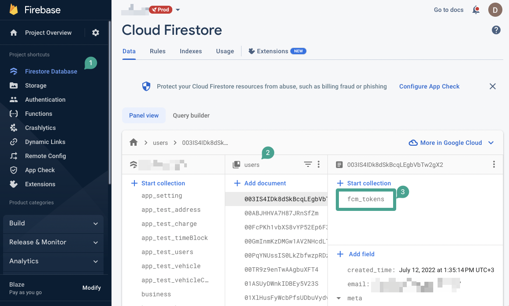
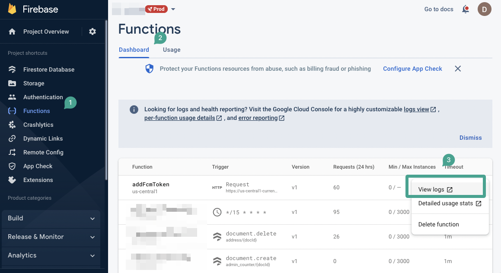

# FCM Token Generation Troubleshooting

When a user does not have an `fcm_token` sub-collection in their Firestore document, push notifications cannot be delivered to their device. This guide outlines the possible causes and solutions for resolving missing `fcm_token` sub-collections in FlutterFlow apps.

**Understanding the Issue**

Push notifications require a valid Firebase Cloud Messaging (FCM) token, which is generated when a user logs in or signs up on a physical device. This token is typically stored in the `fcm_token` sub-collection of the user document in Firestore. If this sub-collection is missing, the device cannot receive push notifications.

Possible causes for missing tokens include:

    - Failures during FCM token generation.
    - Incomplete authentication flows.
    - Permission issues preventing token creation.
    - Invalid input data passed to Cloud Functions.

Here are the steps to verify user eligibility for push notifications:

    1. Check Firestore for `fcm_token` Sub-Collection

        1. Open the **Firebase Console**.
        2. Navigate to **Firestore Database**.
        3. Locate the user document.
        4. Verify that the `fcm_token` sub-collection exists.

        If present, the user is eligible to receive push notifications.

        

### Troubleshooting Missing FCM Token Generation

    1. **Verify Cloud Function Execution**

        The `addFcmToken` Cloud Function is responsible for generating and storing FCM tokens. If token generation fails, review its logs:

        1. Open the **Firebase Console**.
        2. Navigate to **Functions**.
        3. Locate the `addFcmToken` function.
        4. Open its **Logs** to review errors or warnings.

        

    2. **Resolve Permission Errors**

        Proper permissions are required to allow the Cloud Function to write FCM tokens to Firestore.

            **Verify Firebase Security Rules**

                - Ensure your Firebase security rules permit writing to the `users` collection and its sub-collections.

            **Verify FlutterFlow Service Account Permissions**

                The `firebase@flutterflow.io` service account must have the following roles:

                    - `Editor`
                    - `Cloud Functions Admin`
                    - `Service Account User`

                **How to Assign Roles**:

                    1. Open the **Firebase Console**.
                    2. Go to **Project Settings > Users & Permissions**.
                    3. Locate the `firebase@flutterflow.io` service account.
                    4. Assign any missing roles.

                    Refer to **[this guide](/resolving-firestore-index-deployment-issues)** for full instructions.

    3. **Validate Input Data Passed to Cloud Function**

        If a Cloud Function fails with status code `400`, it may be receiving invalid input data.

        - Verify that your authentication flow correctly retrieves the user ID before calling the function.
        - Ensure the user ID is not `null`, empty, or malformed.
        - Implement conditional validation before invoking the function.
        - Add logging to your authentication code and Cloud Functions to trace failures.

        This is especially important if you are using custom authentication logic. If you are using FlutterFlow's built-in authentication, this issue is unlikely.

    4. **Check for FCM Server Errors**

        Additional reasons FCM token generation may fail include:

        - FCM server downtime or temporary outages.
        - Incorrect or malformed requests sent from the Cloud Function to the FCM server.
        - Insufficient API access permissions.
        - Invalid or missing input data (e.g. device token).

        If server issues persist, consider contacting Firebase support for assistance.

By following this complete troubleshooting process, you can ensure your users successfully receive push notifications.

---
