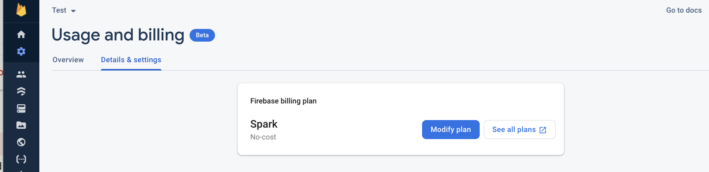
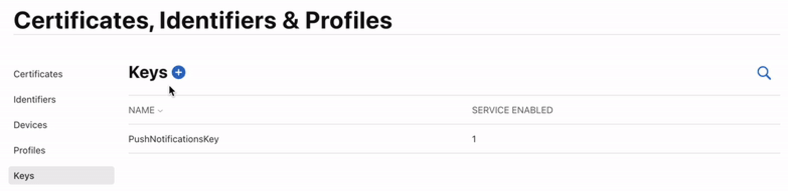
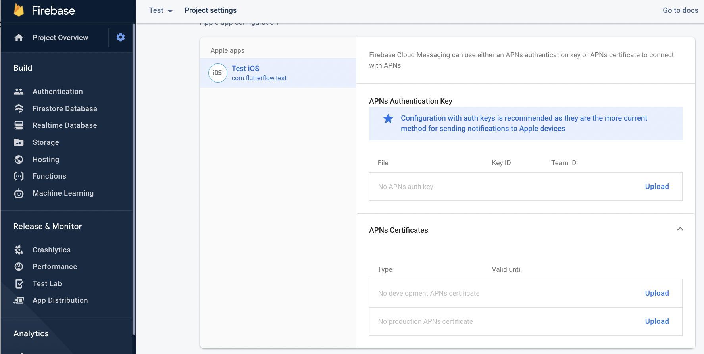
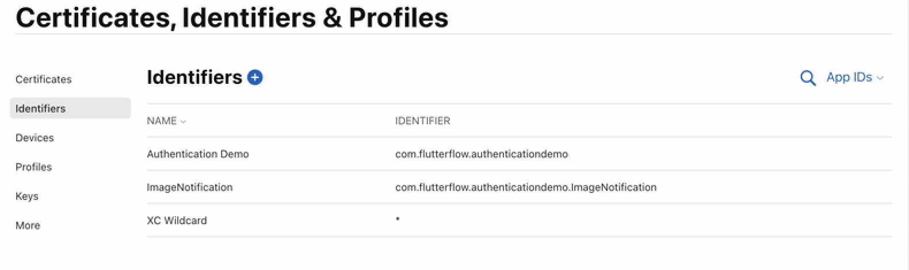
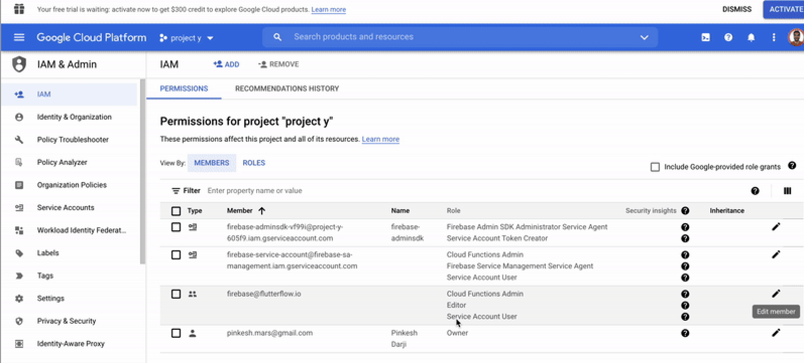
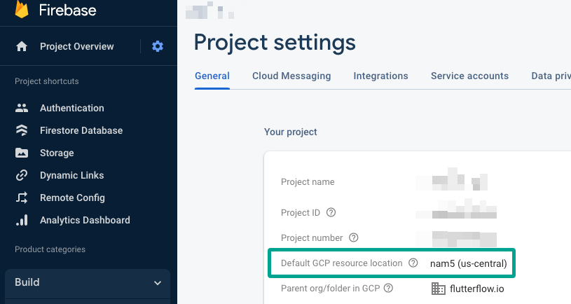
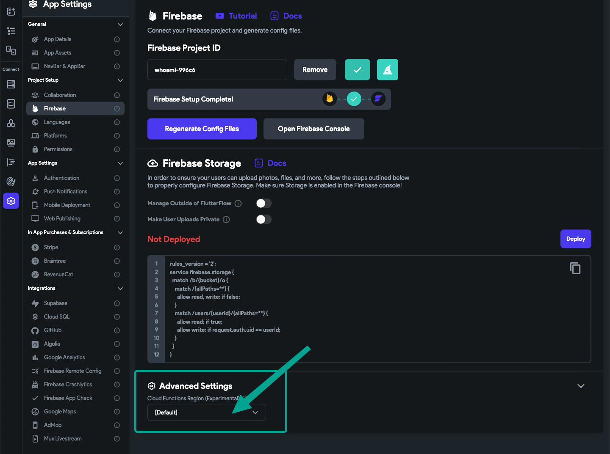
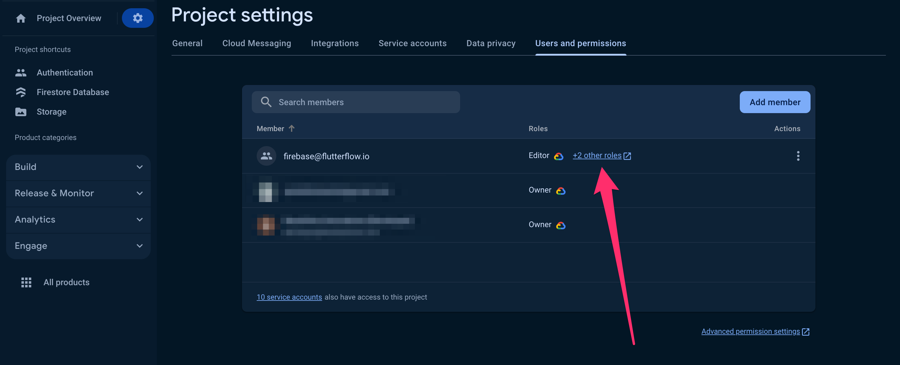
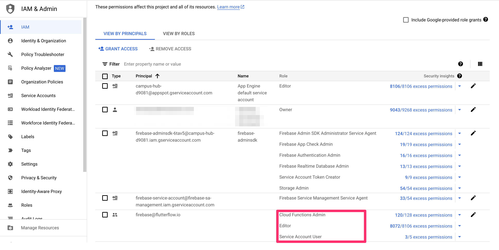

# Firebase Push Notification Troubleshooting

Push notifications are essential for keeping users informed through timely alerts and updates. However, several common configuration issues can prevent push notifications from working as expected in FlutterFlow projects. This guide outlines potential causes and solutions.

:::info[Prerequisites]
Before troubleshooting, ensure the following:

- The FlutterFlow app is connected to Firebase.
- The app is installed on a physical device (push notifications do not work on simulators).
- The user is logged in to the app.
- The app is not currently open when testing notifications.
:::

1. **Verify Firebase Blaze Plan Subscription**

    - Navigate to **Firebase Console > Project Settings > Usage & Billing > Details & Settings**.
    - Confirm that the subscription is on the **Blaze Plan**.
    - If the current plan is **Spark**, upgrade by selecting **Modify Plan**.

    

2. Verify Apple Push Notification (APN) Key Configuration

    - **Create an APN Key:**

      - Navigate to the Apple Developer Console.
      - Go to **Certificates, Identifiers & Profiles > Keys**.
      - Create a new key for push notifications if one does not exist.

      

      Instructions for **[adding a push notification key](https://developer.apple.com/account/resources/authkeys/list)**

    - **Upload the APN Key to Firebase**

      - Navigate to **Firebase Console > Project Settings > Cloud Messaging > iOS section**.
      - Upload the APNs Authentication Key.

      

      Instructions for **[uploading APN key to Firebase](https://firebase.google.com/docs/cloud-messaging/ios/certs)**.

3. **Create Push Notification Identifier for Apple**

    - Go to the Apple Developer Console.
    - Navigate to **Certificates, Identifiers & Profiles > Identifiers**.
    - Create or verify an identifier for push notifications.

    

    Instructions for **[creating a push notification identifier](https://developer.apple.com/account/resources/identifiers/list)**.

4. **Verify Cloud Permissions for FlutterFlow Service Account**

    - Go to **Firebase Console > Project Settings > Users & Permissions**.
    - Locate the **firebase@flutterflow.io** service account.
    - Ensure the following roles are assigned:

      - Editor
      - Cloud Functions Admin
      - Service Account User

    

    Instructions to **[add required cloud permissions](/integrations/firebase/connect-to-firebase/#allow-flutterflow-to-access-your-project)**.

5. **Confirm Cloud Function Region Consistency**

    - In **FlutterFlow > Settings > Firebase > Advanced Settings**, verify the Cloud Functions Region matches the region configured in **Firebase > Project Settings > Cloud Functions Location**.

    

    

6. **Update FlutterFlow to Latest Version**

    **Refresh FlutterFlow:**

      - On Windows: Press `Ctrl + R`.
      - On Mac: Press `Cmd + R`.

    **Clear Browser Cache:** Clear the browser cache to ensure the latest version loads properly.

7. **Resolve FlutterFlow Insufficient Permissions Error**

    If an insufficient permissions error occurs:

      1. Open **Firebase Console > Project Settings > Users & Permissions**.
      2. Verify the **firebase@flutterflow.io** account exists.
      3. Assign the following permissions:

        - Editor
        - Cloud Functions Admin
        - Service Account User

      

      4. Save changes and retry the operation in FlutterFlow.

      

