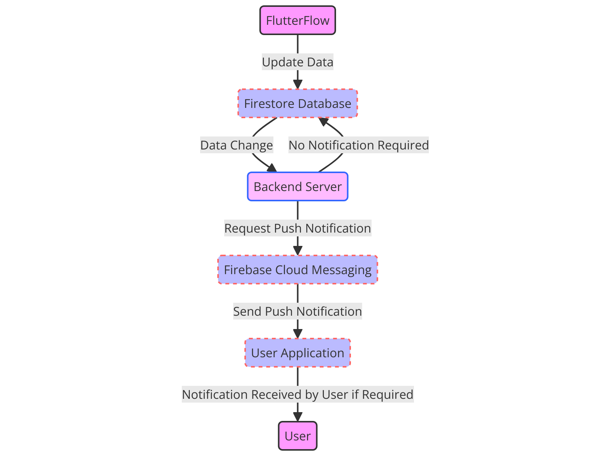
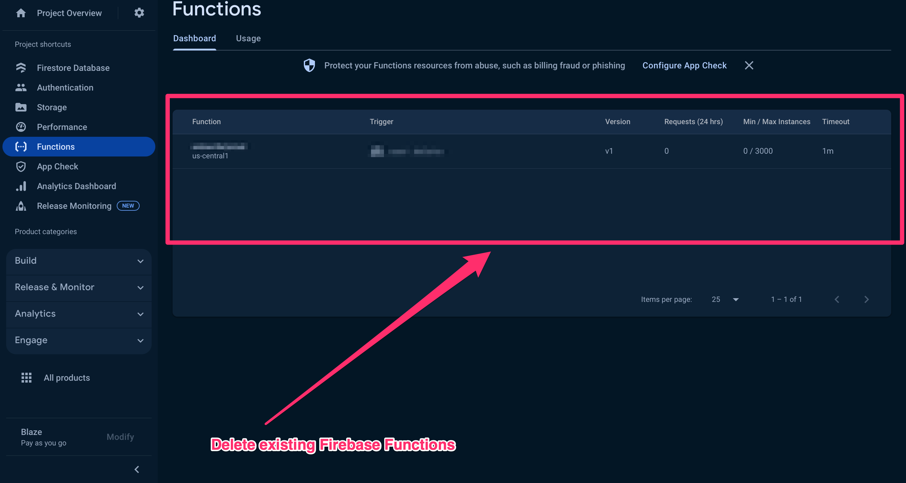
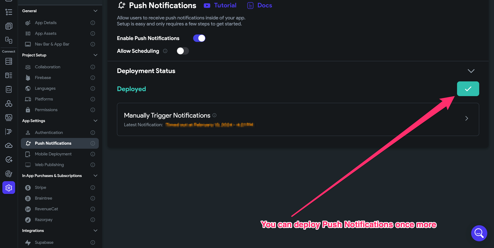
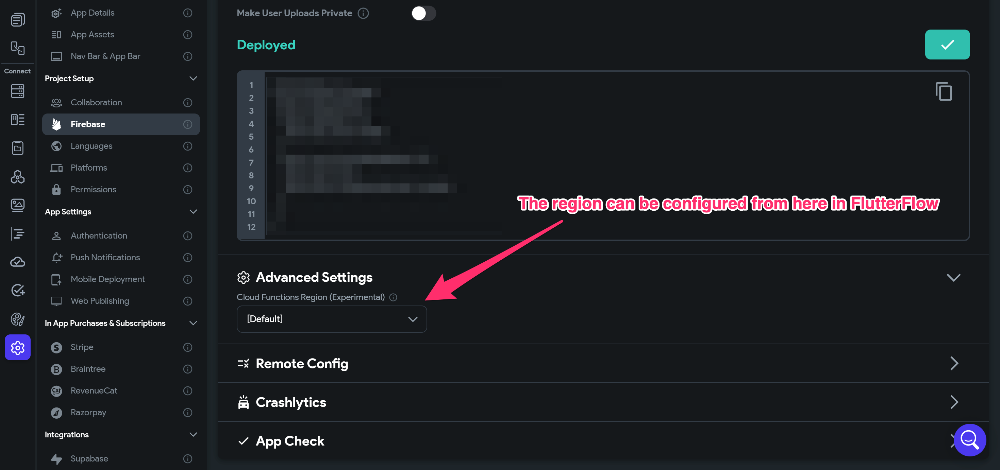
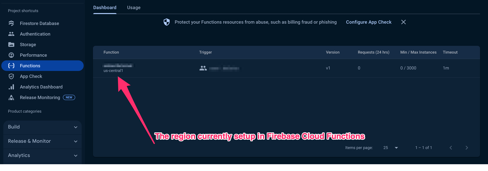
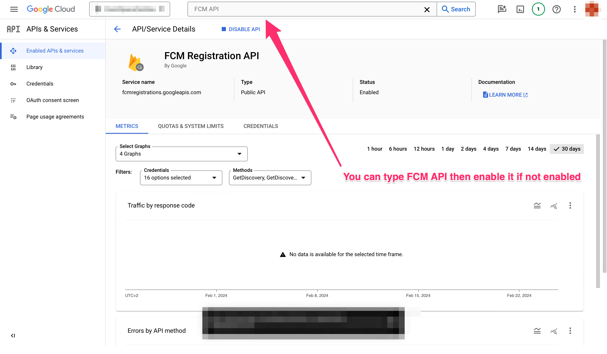

---
keywords:
  - push notifications
  - firebase
  - cloud functions
  - troubleshooting
slug: /troubleshooting/notifications/fix-push-notifications-sent-to-zero-devices
title: Fix Push Notifications Sent to Zero Devices
description: >-
  Push notifications allow apps to send updates, alerts, and messages directly
  to users.
tags:
  - FlutterFlow
  - Troubleshooting
  - Notifications
last_verified: 2026-09-02
---
# Fix Push Notifications Sent to Zero Devices

Push notifications allow apps to send updates, alerts, and messages directly to users. In some cases, after triggering a push notification, FlutterFlow displays the following message:

```js
Push Notification sent to 0 devices
```

This means that the notification was attempted, but no eligible devices received it.

Here are the causes:

  - No registered devices have generated FCM tokens.
  - The audience query matched no current token records.
  - Misconfiguration in Firebase or FlutterFlow settings.
  - Missing permissions or API configuration.
  - Recipient devices have blocked push notifications.

The following steps below outline how to troubleshoot and resolve this issue:

  1. **Verify Firebase Functions Are Enabled**

      - Ensure that Firebase Functions are enabled in the Firebase Console.
      - Confirm that your project is on the Blaze Plan.

      


  2. **Inspect Before Redeploying Firebase Cloud Functions**

      - Check the send-function logs, audience query, deployment revision, and first error. Do not delete a working production function before a replacement is deployed and validated.

        

      - After deletion, redeploy Push Notifications from FlutterFlow:

        

  3. **Verify Server Region Configuration**

      - Ensure that the Firebase server region matches the configuration in FlutterFlow.
      - For example, if the server region is `us-central1`, it must match in both Firebase and FlutterFlow.

        In FlutterFlow:
          Navigate to **Settings > Firebase > Advanced Settings** and set the correct region.

          

        In Firebase:
          Verify that Cloud Functions are deployed to the same region.

          

  4. **Check FCM API Settings in Google Cloud Console**

      - Open the **[Google Cloud Console](https://console.cloud.google.com/)**.
      - Search for `FCM API` and ensure it is enabled.

        

      - Use the current FCM HTTP v1/Admin SDK credential flow. Do not put legacy server keys or service-account JSON in app code, screenshots, logs, or chat.

  5. **Verify Cloud Permissions for flutterflow.io Service Account**

      To ensure proper communication between FlutterFlow and Firebase:

      - Step 1: Open Firebase Console

        - Go to [Firebase Console](https://console.firebase.google.com/).
        - Select your project.

      - Step 2: Navigate to Users & Permissions

        - Open **Project Settings** via the gear icon (⚙️).
        - Select **Users & Permissions**.

          

      - Step 3: Verify Existing Permissions

        - Locate the `firebase@flutterflow.io` service account.
        - Compare the roles with the current FlutterFlow Firebase setup guide and identify the exact denied permission.

          

      - Step 4: Add Only Documented Missing Permissions

        - Use the current [Firebase connection instructions](/integrations/firebase/connect-to-firebase/#allow-flutterflow-to-access-your-project). Do not broaden IAM to fix an audience or device-token problem.

        

      - Step 5: Verify All Permissions Are Applied

        - Confirm that all required roles now appear next to the service account.

Following these steps should resolve most push notification delivery issues.

“Sent to 0 devices” is an audience/token result, not evidence that offline devices rejected a valid send. Verify notification permission, current token records, token refresh, target-user selection, and cleanup of permanently invalid tokens.

## Related documentation

See [FCM Token Generation Troubleshooting](/troubleshooting/notifications/fcm-token-generation-troubleshooting) for a related FlutterFlow workflow.
