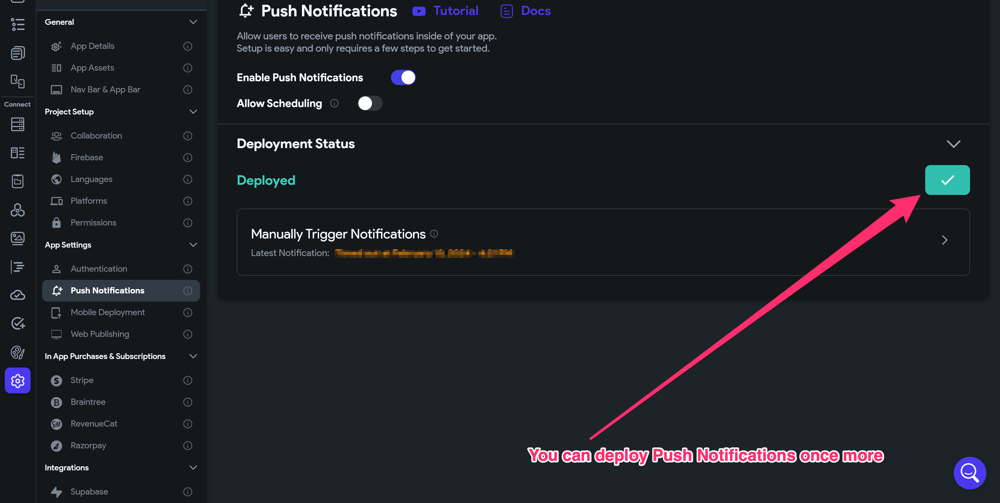
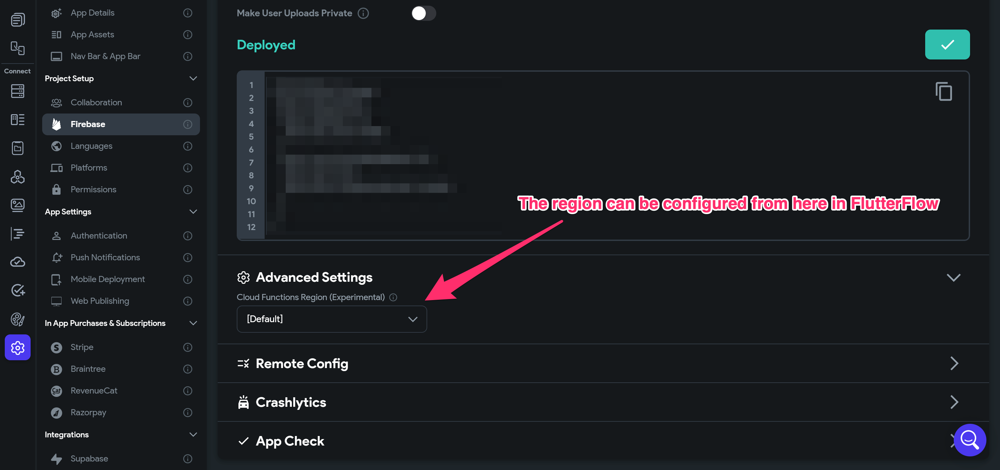
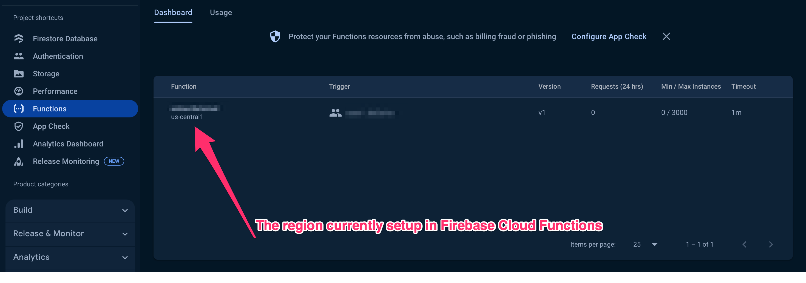
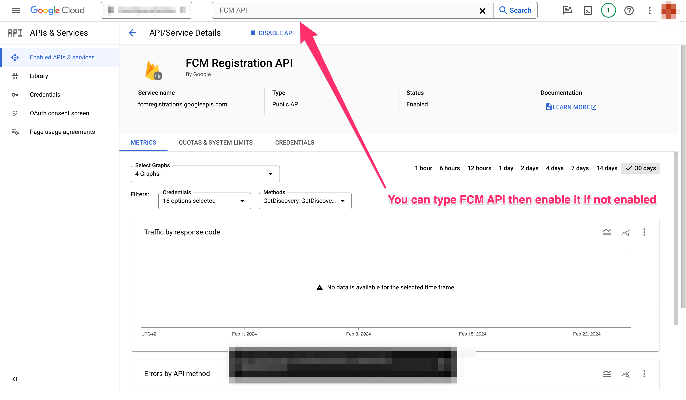
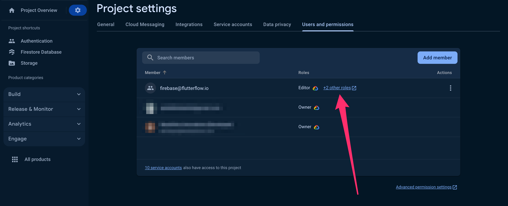

# Fix Push Notifications Sent to Zero Devices

Push notifications allow apps to send updates, alerts, and messages directly to users. In some cases, after triggering a push notification, FlutterFlow displays the following message:

```js
Push Notification sent to 0 devices
```

This means that the notification was attempted, but no eligible devices received it.

Here are the causes:

  - No registered devices have generated FCM tokens.
  - Target devices were offline at the time of sending.
  - Misconfiguration in Firebase or FlutterFlow settings.
  - Missing permissions or API configuration.
  - Recipient devices have blocked push notifications.

The following steps below outline how to troubleshoot and resolve this issue:

  1. **Verify Firebase Functions Are Enabled**

      - Ensure that Firebase Functions are enabled in the Firebase Console.
      - Confirm that your project is on the Blaze Plan.

      


  2. **Delete and Redeploy Firebase Cloud Functions**

      - Manually delete the Cloud Functions related to push notifications from Firebase.

        

      - After deletion, redeploy Push Notifications from FlutterFlow:

        

  3. **Verify Server Region Configuration**

      - Ensure that the Firebase server region matches the configuration in FlutterFlow.
      - For example, if the server region is `us-central1`, it must match in both Firebase and FlutterFlow.

        In FlutterFlow:
          Navigate to **Settings > Firebase > Advanced Settings** and set the correct region.

          

        In Firebase:
          Verify that Cloud Functions are deployed to the same region.

          

  4. **Check FCM API Settings in Google Cloud Console**

      - Open the **[Google Cloud Console](https://console.cloud.google.com/)**.
      - Search for `FCM API` and ensure it is enabled.

        

      - Make sure that a valid server key is available in Firebase Console. If missing, create one through Google Cloud Console.

  5. **Verify Cloud Permissions for flutterflow.io Service Account**

      To ensure proper communication between FlutterFlow and Firebase:

      - Step 1: Open Firebase Console

        - Go to [Firebase Console](https://console.firebase.google.com/).
        - Select your project.

      - Step 2: Navigate to Users & Permissions

        - Open **Project Settings** via the gear icon (⚙️).
        - Select **Users & Permissions**.

          

      - Step 3: Verify Existing Permissions

        - Locate the `firebase@flutterflow.io` service account.
        - Verify the following roles are assigned:
          - `Editor`
          - `Cloud Functions Admin`
          - `Service Account User`

          

      - Step 4: Add Missing Permissions

        - If any roles are missing:
          - Click **Add Member**.
          - Enter `firebase@flutterflow.io`.
          - Select missing roles from the dropdown:
            - `Editor`
            - `Cloud Functions Admin`
            - `Service Account User`

        

      - Step 5: Verify All Permissions Are Applied

        - Confirm that all required roles now appear next to the service account.

Following these steps should resolve most push notification delivery issues.

