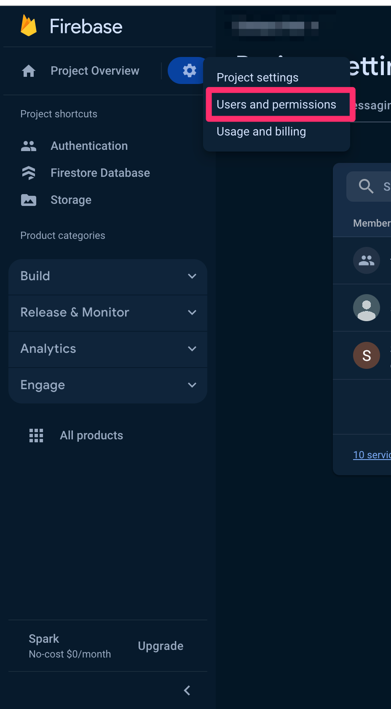
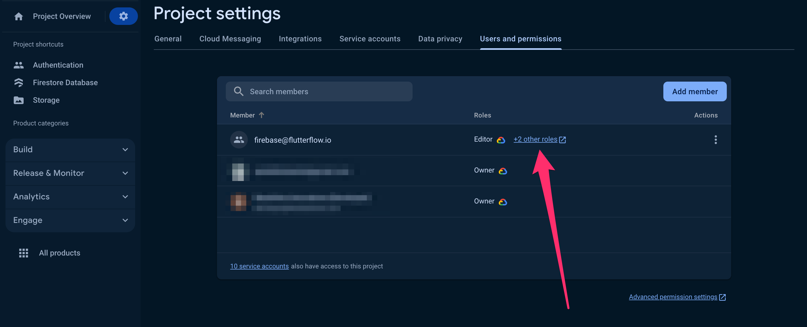
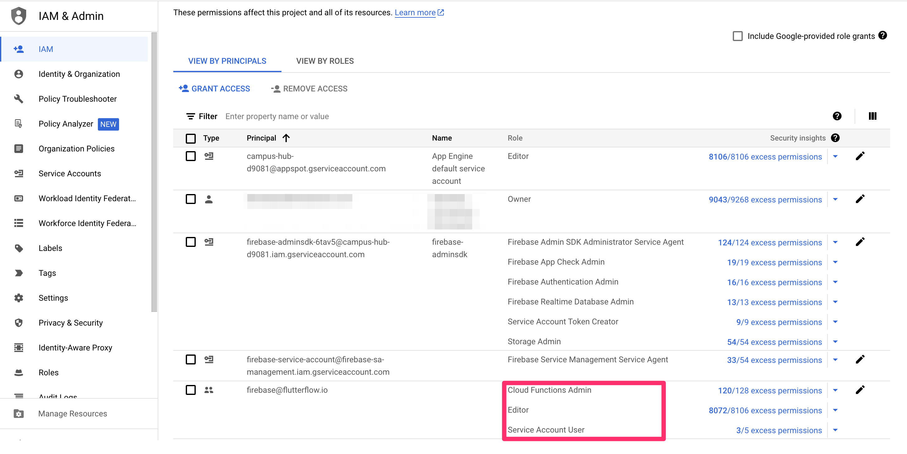

# Fix Insufficient Permissions for Push Notifications

If you encounter an **"Insufficient Permissions"** error when deploying push notifications from FlutterFlow to Firebase, it usually means the `firebase@flutterflow.io` service account does not have the necessary permissions in your Firebase project. This guide will walk you through how to resolve this issue.

:::info[Prerequisites]
Before proceeding, ensure you have:
- Connected your Firebase project to FlutterFlow.  
- Completed the steps in **[Connect to Firebase](/integrations/firebase/connect-to-firebase/#allow-flutterflow-to-access-your-project)**.
:::

**Steps to Resolve the Insufficient Permissions Error:**

    1. **Open Firebase Console**

        - Go to the **[Firebase Console](https://console.firebase.google.com/)**.
        - Click on your project tile to open your FlutterFlow project.

    2. **Navigate to Users & Permissions:**

        - In the Firebase project dashboard, click on the gear icon (⚙️) to open **Project Settings**.
        - From the left sidebar, select **Users & Permissions**.

            

    3. **Locate the `firebase@flutterflow.io` Account**

        - In the **Users** tab, search for `firebase@flutterflow.io`.
        - If this account is missing, click **Add User**, enter `firebase@flutterflow.io` as the email address, and continue.

    4. **Assign the Required Permissions**

        - Click on `firebase@flutterflow.io` to open the user details.
        - Ensure the following roles are assigned:

            - **Editor**
            - **Cloud Functions Admin**
            - **Service Account User**

                

            - If any permissions are missing, click **Add Permissions** and select the missing roles.

5. **Save Changes:**

    - After assigning all necessary roles, click **Save** to apply changes.
    - Verify that all permissions have been successfully added and saved.

6. **Retry the Operation in FlutterFlow:**

    - Return to your FlutterFlow project.
    - Retry the action that previously failed due to insufficient permissions.

    The error should now be resolved. If you continue to experience issues, please contact the FlutterFlow Support team.

:::note
Granting the correct permissions to `firebase@flutterflow.io` is essential for FlutterFlow to deploy push notifications and access Firebase resources correctly.

:::

:::info[Additional Resources]
- [Connect FlutterFlow to Firebase](/integrations/firebase/connect-to-firebase/#allow-flutterflow-to-access-your-project)
- [Firebase Roles and Permissions](https://firebase.google.com/docs/projects/iam/roles)
:::

