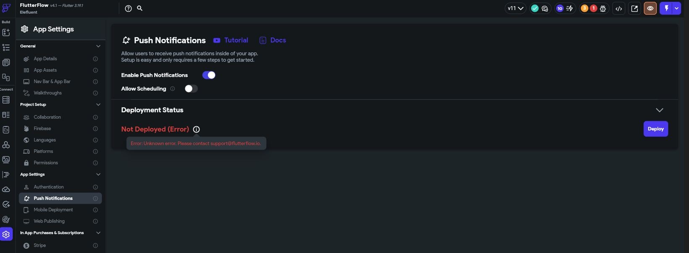
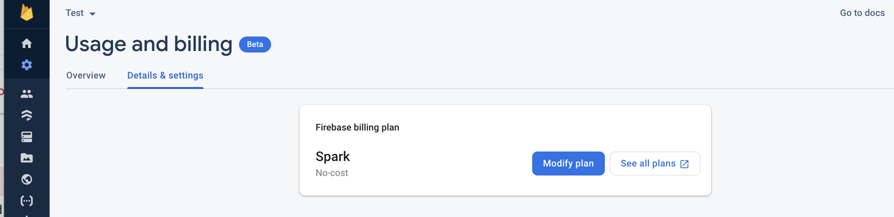

Push notifications play a vital role in mobile apps, letting you connect with your audience and update them on key developments. But, there are instances when push notifications fail to deliver. In this guide, we'll explore some typical problems that hinder push notifications in FlutterFlow and offer detailed instructions on how to fix them.

:::tip Using CodeMagic? [Skip ahead!](https://mdxjs.com/playground/)

:::

### Without CodeMagic 

#### 1. Ensure your subscription status hasn't changed.
Head to the [Firebase Console](https://console.firebase.google.com/) and select Project Settings > Usage & Billing > Details & Settings. 

If you see Spark listed, you will need to select Modify Plan and upgrade to a Blaze Plan. 

[Click here](https://firebase.google.com/docs/projects/billing/firebase-pricing-plansoject) for more information on Firebase pricing plans.

#### 2. Ensure your subscription status hasn't changed.

...