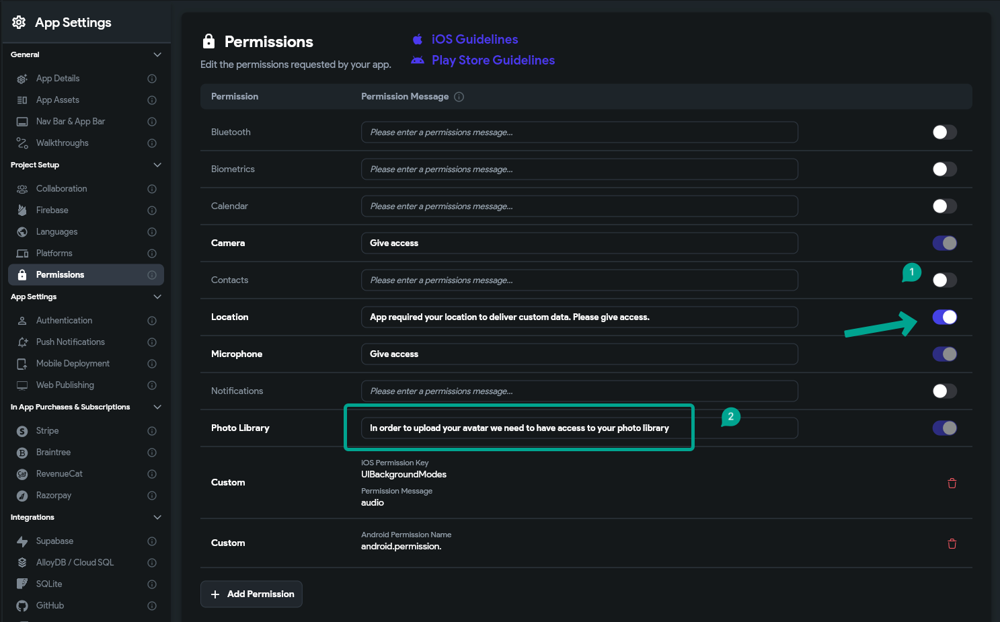

# Missing Purpose String in Info.plist

If you're seeing the following error while submitting your iOS app, it means your app is referencing APIs that access sensitive user data, but your `Info.plist` file doesn't include a clear explanation (purpose string) for using that data.

> **ITMS-90683: Missing Purpose String in Info.plist**  
> Your app‘s code references one or more APIs that access sensitive user data. The app‘s Info.plist file should contain a [permission] key with a user-facing purpose string explaining clearly and completely why your app needs the data. This includes permissions required by external libraries or SDKs.

---

## Why This Happens

Apple requires a **user-facing explanation** (a “purpose string”) in your app’s `Info.plist` for each permission your app—or any integrated SDK—requests. Without these, your app will be rejected during submission.

---

## How to Fix It

### 1. Identify Required Permissions

Review your app’s functionality and identify any features that access:

- Camera  
- Microphone  
- Location  
- Photo library  
- Contacts  
- Calendars  
- Bluetooth, etc.

### 2. Go to FlutterFlow Settings

- Open your project in **FlutterFlow**
- Navigate to **Settings > Permissions**

### 3. Add Purpose Strings

For each permission your app uses:

- Enable the permission toggle
- Add a **clear, descriptive explanation** of how the app uses that feature

> Example:  
> **NSMicrophoneUsageDescription**  
> _“We use your microphone so you can record and send audio notes.”_

> **NSPhotoLibraryUsageDescription**  
> _“This app requires access to your photo library to let you upload images.”_

### 4. Follow Apple’s Guidelines

- Keep your descriptions **user-friendly**
- Be **honest and specific**
- Avoid vague language like “we need this permission for app functionality”

### 5. Test Your App

- Run your app on a physical iOS device
- Ensure permission prompts appear
- Confirm your purpose strings are visible and appropriate

---

## Why It Matters

Providing a transparent explanation for data access builds user **trust** and improves the **likelihood of permission approval**. It’s also an Apple App Store requirement.

---

## Summary

✅ Always add a purpose string in `Info.plist` for **every permission your app (or its SDKs) may access**  
✅ Use clear, respectful, and honest language  
✅ Test all permission flows before app submission

If you’ve done all of this and the error persists, feel free to contact FlutterFlow support for additional help.
