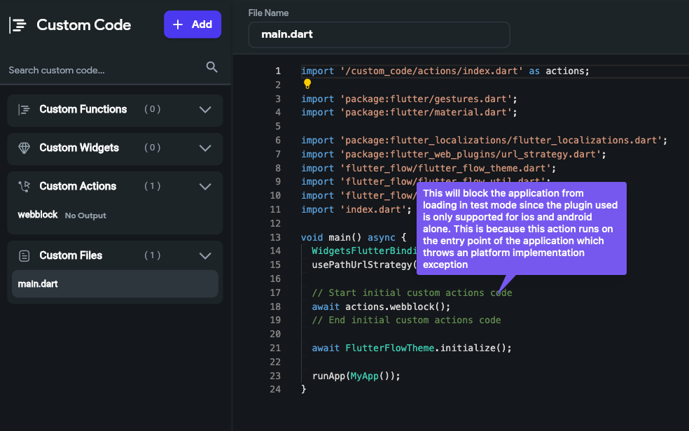
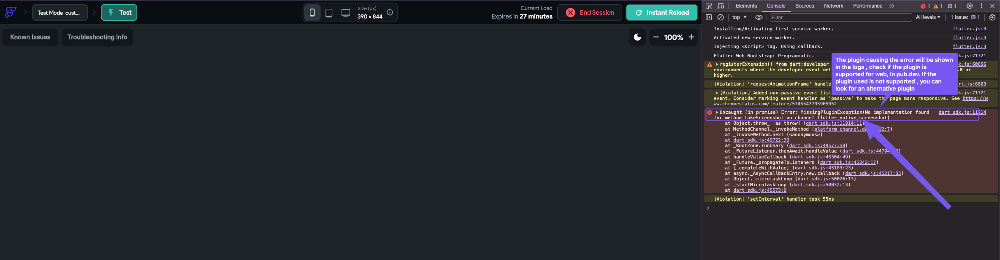
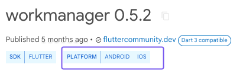
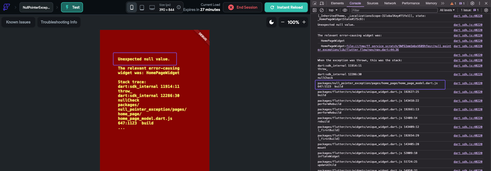
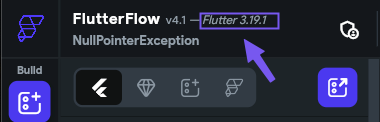
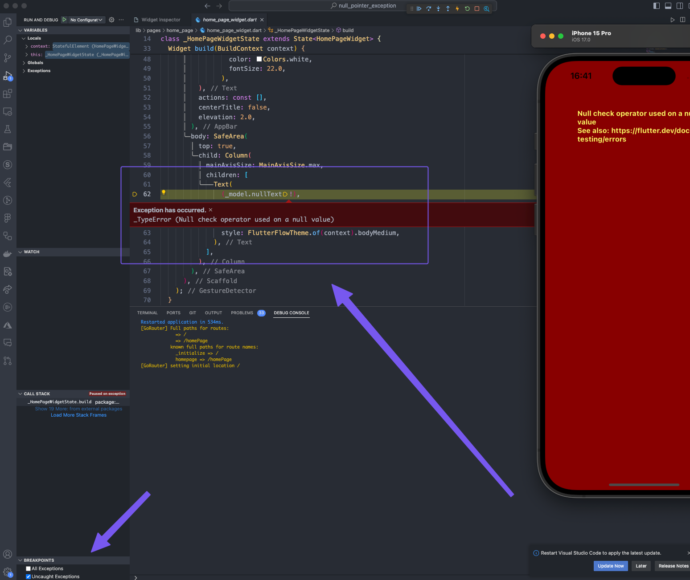
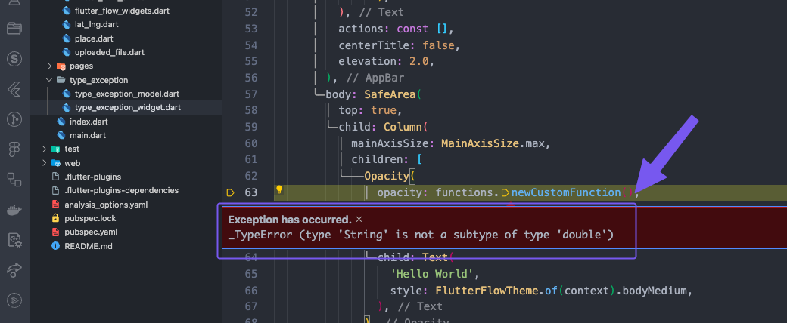
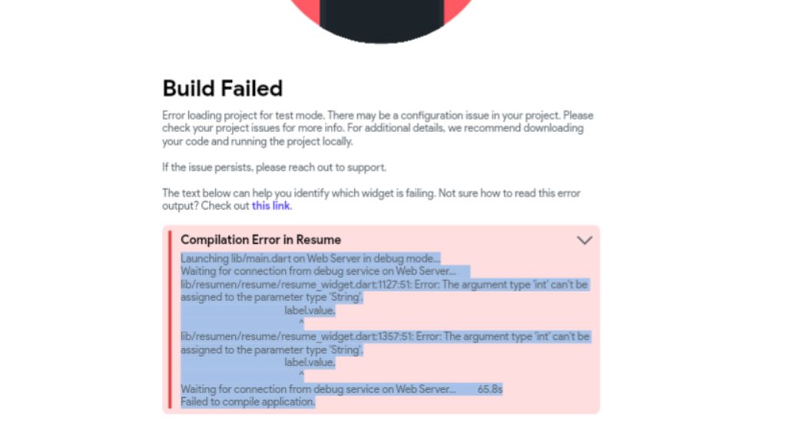
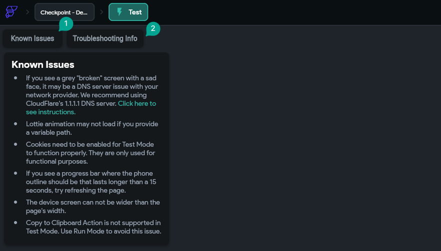

# Test Mode Won’t Load

Introduction
When developing applications with Flutter, encountering a red screen filled with errors during the test mode is a common challenge. This issue, while alarming at first glance, often stems from a range of causes such as bugs in the code or misconfigurations within the project. To help you navigate through this problem and restore functionality to your test mode, this guide will explore all potential causes and scenarios that might lead to these errors.

Scenarios You May Encounter
There are several cases that can lead to trouble loading test mode – resulting in a red screen, or even displaying a blank page when testing your project.

**1. Test Mode Infinite Loading**

Service Outage
When a service outage is experienced, it may cause Test Run to load for a long time.
To verify this is not a global service outage, test `Test mode` the service with a different project. If this affects more than two different projects, please report this **immediately** to support@flutterflow.io

Custom code method that runs an unsupported implementation (not supported on the web) in the main.dart file

Running a custom code that is not supported on the web platform will result in an Infinite load in test mode

To identify this, open the developer's console and check the logs shown

To open the Console log, use **Option + ⌘ + J** (on macOS) or Shift + CTRL + J (on Windows/Linux). The console will either open up within your existing Chrome window, or in a new window. You may have to select the Console tab.




The plugin causing the error will be indicated in the logs; verify whether the plugin is supported for the web on `pub.dev`. If the plugin used is not supported, you can look for an alternative plugin, here grouped in categories.

To prevent other platform implementation exceptions, check the supported platforms for every third-party library that you are using in the project.



2. Red Screen – Null Pointer Exceptions
Accessing null values in the project can also result in a red screen. This could be coming from:

Trying to access a wrong API JSON path

When an API response returns an empty/null value that is passed to a list.

When Page parameters are not passed but used in the destination page

Null values from custom action/function output used in the widgets.

Developed/designed `User Interface` trying to access null values from a database or API

Custom Code trying to access null values that were passed as parameter

Opening the browser console log will help you to point to the page that is causing the error. However, this doesn’t show the actual line of code or the variable that is throwing the error.



To effectively identify the value that is causing the issue, it is recommended that you download the code and run it locally. You can follow these steps:

Download your code from FlutterFlow

Open the downloaded project in your preferred IDE ( We recommend VS Code – it provides great logs for debugging)

Run the app on your device – make sure you have a Flutter environment set up on your local device and the Flutter SDK is of the same version as the Flutter Version shown in FlutterFlow Builder! (Here are steps for Windows , MacOS, or UNIX .



The VS Code debugger will break the code execution where the error is, and you can use this information to identify the variable that is injecting a null value to the User interface.

You will need to check the `Breakpoints` `uncaught exception`s in Vscode so that the code execution stops at the line where the bug is.

**Tip**: In some cases, you might have a number of errors in your project. This will result in a number of code execution blocks when the breakpoints are enabled. To effectively identify the null pointer exception, we recommend only enabling the breakpoints just before you navigate to the page that was throwing the error.



3. Red Screen Error - Type Exception
Assigning the wrong data type can also result in a red screen when compiling your project in test mode. This can result when;

Trying to assign a wrong type from the API JSON path to a widget or a variable that takes in a different data type than the supplied type

Wrong data type from custom code output

```
TIP: Note that some type exceptions, like double/int, may not appear in test mode but will when running the project locally. This is because in test mode, the code is compiled to javascript, which is not type sensitive, While dart, which is run on the mobile device, is type strict language
```



```
NOTE: In most cases also this type of exception, it is recommended to download the code locally. Check the steps in the Red screen - Null Pointer Exceptions
```

4. Build Errors: Test Mode won't Compile (Applies also for Run Mode)
A number of build failed/ compile errors are a result of bugs in the project. This can result when;

The project has errors in the project that are not shown by the project analyzer

Wrong data type assignment in Builder widgets,i.e., assigning an integer to a label



Using an Incompatible third-party plugin in the project

Code generation error (report to support for investigation)

If your project shows no compile errors in the builder but cannot be built successfully, please contact the support team for assistance.

5. Blank Screen on Specific Pages While Running Test Mode
Test mode runs may compile successfully; however, when you navigate to some of your pages in the project, they are blank. This can result because of ;

Wrong flex assignment in the project: This kind of case will result in UI render box constraint issues shown in the console log. To troubleshoot this, we recommend downloading the project locally and navigating to the page that is not showing the content. The debugger will log the actual line number that is causing this render box paint error.

The most common widgets to check that cause this error are Rows With containers / wrapped with containers and scrollable columns.

6. Bonus (Other Known Issues)
In some cases, the Test mode run may fail due to minor user faults. In these cases, it is recommended to check these steps when troubleshooting the issue

Make sure they read the troubleshooting notes in the test mode in the top left side of the windows



Make sure to do a TEST build from the same project and check the result

Open the test mode in the same browser that you are logged in to Flutterflow in

Check the custom codes. There could be packages that are not supported on the web in their custom code

