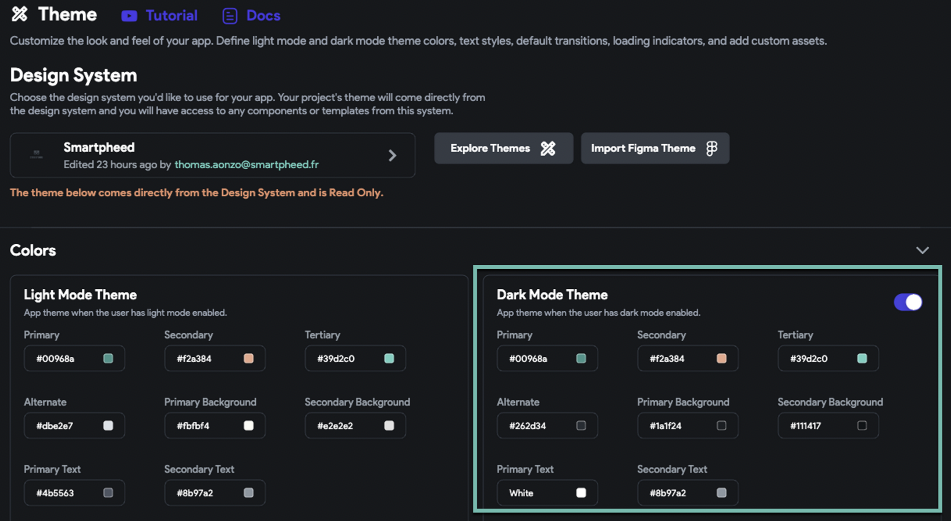
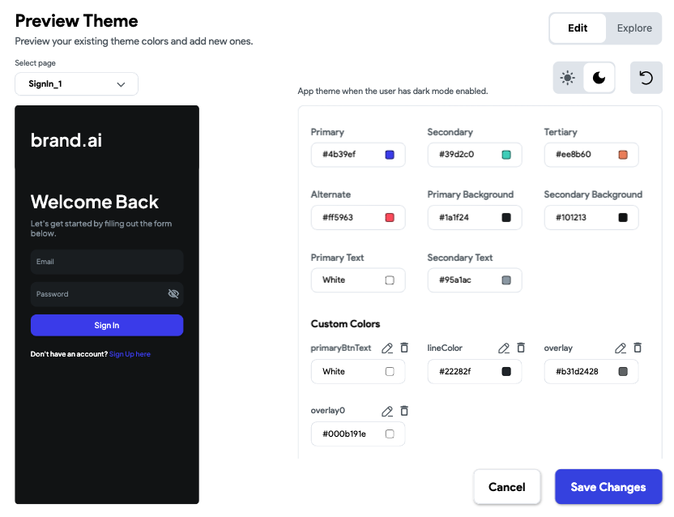

# App Colors Display Incorrectly on Real Device

If your app’s colors appear differently when testing on a physical device, this is often due to **Dark Mode settings** or incomplete **theme configurations**.

Most devices support **Light**, **Dark**, or **Automatic** appearance modes. If your device is set to **Dark Mode** and your app has not been configured to fully support it, colors may appear incorrectly or unreadably.

Follow the steps below to resolve this issue:

1. **Check Your App’s Dark Mode Setting**

  - Open your project in **FlutterFlow**
  - Go to **Settings > Theme**
  - Confirm whether **Dark Mode** is enabled

  

  If Dark Mode is enabled, you have two options:

2. **Fix the Dark Theme or Disable It**

  - **Option A: Complete the Dark Theme Configuration**
    - Update your colors for the dark theme to ensure all UI elements are visible and consistent
    - Use the **Explore Themes** tool to preview how the theme appears

    

  - **Option B: Disable Dark Mode**
    - Simply toggle off the **Dark Mode** setting in FlutterFlow
    - Rebuild and test the app to confirm the color issue is resolved

    Device appearance settings like Dark Mode can override or conflict with app theming. Ensuring your dark theme is properly configured—or disabling it entirely—can resolve most color display issues when running on real devices.
