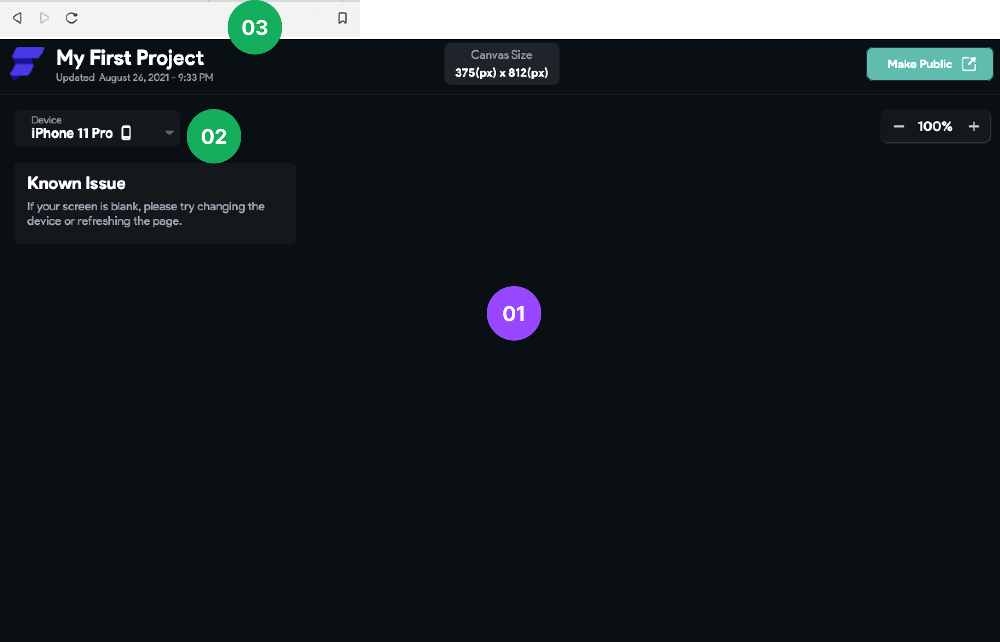

# Black Screen During Preview

If your app screen appears blank during Run Mode, follow these steps to resolve the issue:

:::info[Prerequisites]
- You have already built and deployed at least one screen in your project.
- You are running the app in **Run Mode** within the editor.
:::

1. **Reload the Frame**

    Right-click on the preview screen and select **Reload Frame**.

2. **Change the Device**

    Use the device selector on the left panel to switch to a different preview device.

3. **Refresh the Page**

    Press `Ctrl + R` (Windows) or `Cmd + R` (Mac) to refresh the browser.

4. **Update FlutterFlow and Clear Cache**

    - Ensure you are using the latest version.
    - Clear your browser cache.
    - Log out and back in to your FlutterFlow account.

5. **Submit a Bug Report**

    If none of the steps work, submit a bug report using the **Send Feedback** button in FlutterFlow.

    

:::tip
Blank screens are often temporary. Try switching devices or reloading before making major changes to your project.
:::
