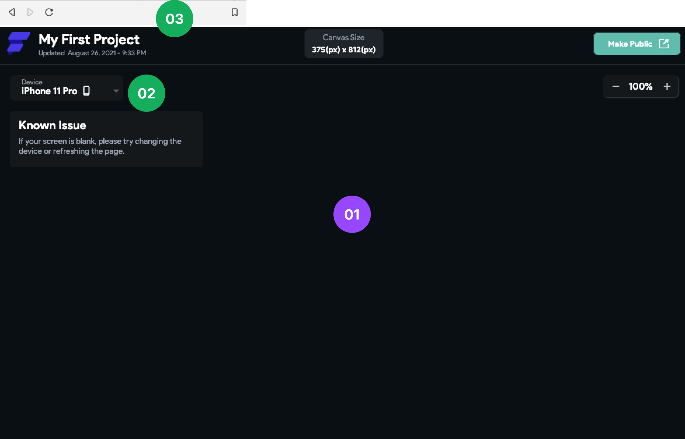

---
keywords:
  - run-mode
  - black-screen
  - preview
slug: /troubleshooting/test-mode/black-screen-during-run-mode
title: Black Screen During Run Mode
description: >-
  If your app screen appears blank during Run Mode, follow these steps to
  resolve the issue: - You have already built and deployed at least one screen
  in your project.
tags:
  - FlutterFlow
  - Troubleshooting
  - Test Mode
last_verified: 2026-09-02
---
# Black Screen During Preview

If your app screen appears blank during Run Mode, follow these steps to resolve the issue:

:::info[Prerequisites]
- You have already built and deployed at least one screen in your project.
- You are running the app in **Run Mode** within the editor.
:::

1. **Reload the Frame**

    Right-click on the preview screen and select **Reload Frame**.

2. **Change the Device**

    Use the device selector on the left panel to switch to a different preview device.

3. **Refresh the Page**

    Press `Ctrl + R` (Windows) or `Cmd + R` (Mac) to refresh the browser.

4. **Inspect the Runtime Error**

    - Open the Run Mode console and capture the first exception, failing request, and affected widget/action.
    - Test the configured initial page, authentication redirect, required route parameters, backend query, and custom code.
    - Redact credentials and user data before sharing logs.

5. **Submit a Bug Report**

    If none of the steps work, submit a bug report using the **Send Feedback** button in FlutterFlow.

    

:::tip
Reloading is a useful isolation step, but a repeatable blank screen usually has a deterministic runtime cause. Avoid changing Firebase rules, IAM, or dependencies until the first error supports that diagnosis.
:::

## Related documentation

See [Firestore Permission Error in Run Mode](/troubleshooting/test-mode/firestore-permission-error-run-mode) for a related FlutterFlow workflow.
