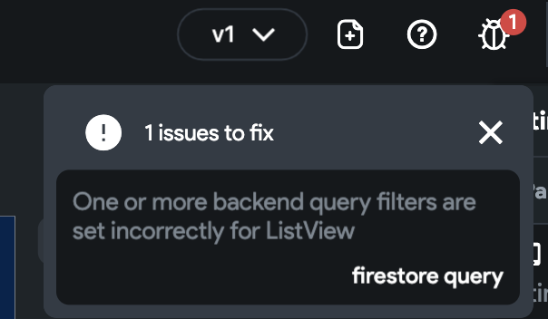

# Gray Screen in Run Mode

Seeing a gray screen in Run Mode usually points to a configuration issue in your Firebase or project settings. Follow these steps to diagnose and resolve the issue.

:::info[Prerequisites]
- You have integrated Firebase with your FlutterFlow project.
- You have access to your Firebase Console.
:::

1. **Check Firebase Permissions**

    Ensure that `firebase@flutterflow.io` has the following roles:

    - **Editor**
    - **Cloud Functions Admin**
    - **Service Account User**

    To verify:

        1. Go to the **Firebase Console**.
        2. Select your project → **Project Overview**.
        3. Navigate to **Users and permissions** → **Advanced permissions**.
        4. Locate `firebase@flutterflow.io` and ensure it has the roles listed above.

            

        If missing, click the pencil icon and assign the roles.

2. **Regenerate Firebase Configuration Files**

    1. In FlutterFlow, go to **Settings & Integrations** → **Firebase**.
    2. Click **Regenerate Config Files**.
    3. In the popup, click **Generate Files**.

        

        :::tip
        You must regenerate config files if you change your project name in FlutterFlow or Firebase.
        :::

3. **Update Firebase Rules**

    1. In FlutterFlow, go to **Firestore** → **Settings**.
    2. Scroll to **Firestore Rules** and click **Deploy**.
    3. Confirm by selecting **Deploy Now** in the popup.

    

    A green checkmark indicates success.

4. **Validate Firebase Schema**

    1. In **Firestore** → **Settings**, scroll to **Firebase Schema Validation**.
    2. Click **Validate**.

        

        If the schema is valid, you’ll see a success message. If not, review the identified issues.

        

5. **Ensure Collections Have Data**

    An empty Firestore collection can result in a gray screen. Visit the Firebase Console → **Firestore Database** to confirm your collections contain documents.

    

6. **Verify Custom Widget Compatibility**

    If your app uses a custom widget, make sure its package supports web. On **[pub.dev](https://pub.dev)**, check that **WEB** is listed under platforms.

    

    If not, choose an alternative package.

7. **Refresh FlutterFlow Environment**

    - Press `Ctrl + R` (Windows) or `Cmd + R` (Mac) to refresh FlutterFlow.
    - Clear your browser cache.
    - Log out and back in.

        :::tip
        Refreshing your session can fix slow or buggy behavior in the UI Builder.
        :::

8. **Retest the Project**

    After completing the above steps, create a new Run Mode session to test if the gray screen issue is resolved.

9. **Test Locally**

    If the issue persists, download your FlutterFlow code and run the project locally to diagnose further.

:::info[Additional Resources]
- **[Run Flutter App Locally](/testing/local-run)**
- **[FlutterFlow Firebase Integration Guide](/integrations/firebase/connect-to-firebase/#step-1-set-up-your-project)**
:::
