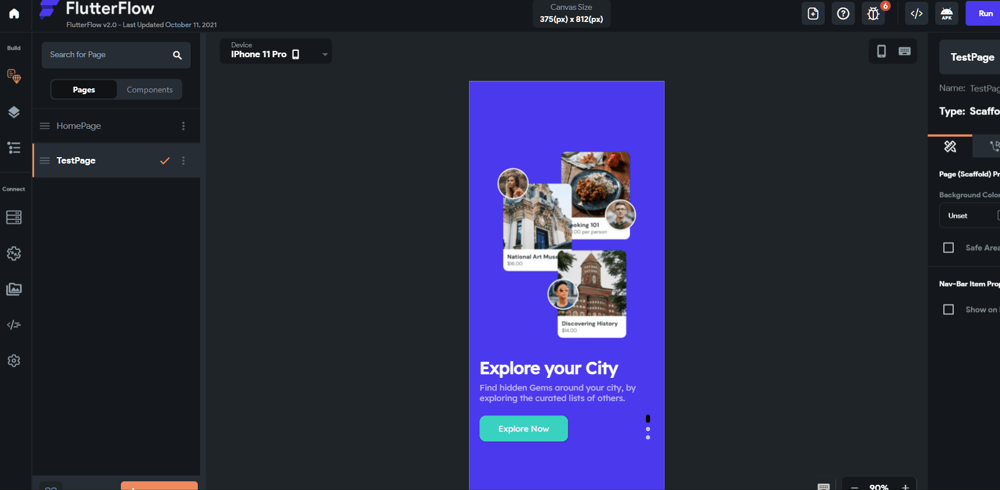
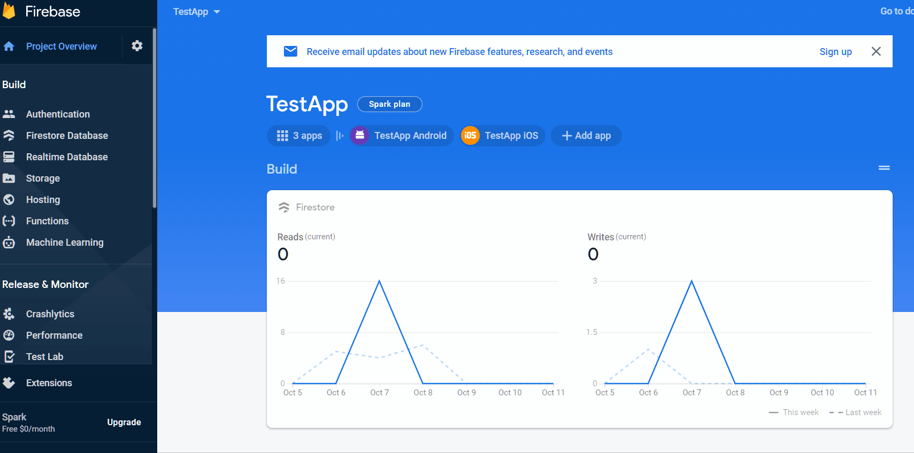

# Loading Spinner in Run Mode

A persistent loading spinner in FlutterFlow's Run Mode usually indicates an issue with your Firestore rules configuration. Updating your rules can resolve this issue.

:::info[Prerequisites]
- You have already connected your FlutterFlow project to Firebase.
- You have access to your Firebase Console.
:::

Here are the steps to fix this error:

1. **Copy Firestore Rules from FlutterFlow**

    1. Open your project.
    2. Navigate to **Firestore** → **Settings**.
    3. Click the **Copy** icon to copy the default Firestore rules.

    

2. **Paste the Rules in Firebase Console**

    1. Open the **[Firebase Console](https://console.firebase.google.com/)**.
    2. Select your project and go to **Firestore Database**.
    3. Open the **Rules** tab.
    4. Paste the copied rules into the editor and click **Publish**.

    

3. **Retest Your Project in FlutterFlow**

    Return to FlutterFlow and run your project again in **Run Mode**. The loading spinner should no longer appear if the Firestore rules were configured correctly.

:::tip
Always keep your Firestore rules up to date after making structural changes to your database in FlutterFlow.
:::
