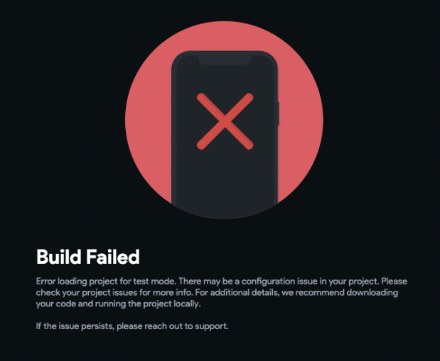

# Resolve Build Failed Error for Test or Run Mode

This error occurs when attempting to create a build in **Run** or **Test** mode, even though no issues appear in the FlutterFlow debug panel.

This error typically indicates a silent or uncaught issue in your FlutterFlow project that prevents the app from compiling.

FlutterFlow generally surfaces project issues through the debug menu. However, some newer error types or configuration issues may not be flagged automatically.

Some common project actions that may cause this build failure include:

   - Copying and pasting widgets with many actions or visibility rules
   - Duplicating widgets that include animations or animation actions
   - Duplicating entire pages or components
   - Referencing a data source or action that does not exist at build time  
   (example, using a periodic action before it’s been defined)
   - A bug in FlutterFlow (if suspected, report it via the **[FlutterFlow GitHub tracker](https://github.com/FlutterFlow/flutterflow/issues))**

If you're experiencing this issue, try the following steps:

1. **Download and Run Locally**
   - If available, download your project code.
   - Run the project in a local environment using Flutter to view the exact error in your terminal or IDE.
   - Identify the error and return to FlutterFlow to make corrections.

2. **Review Recent Project Changes**
   - Use **Snapshots** to compare recent versions of your project.
   - Identify what changed before the error began occurring.

3. **Inspect Actions and Visibility Rules**
   - Open the affected page or widget (e.g., one you recently copied or edited).
   - Check all attached actions, visibility conditions, and variables.
   - Open each action or condition fully, even if no error is visibly flagged.

   :::note[Example]
   The visibility rule below does not appear to contain an error at first glance:

      

   However, once the condition is expanded, you can see that one of the values is unset and displayed in red:

      

   This type of hidden issue can prevent your project from building.
   :::