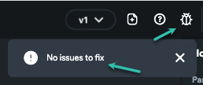
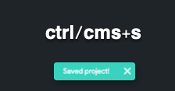
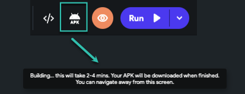

# Resolve Issues Running Code Locally After Exporting Code or APK

When APKs exported from FlutterFlow do not function as expected, a few preliminary checks and rebuild steps can help resolve the issue. This guide outlines how to resolve problems within your project, ensure proper saving and building, and troubleshoot by running the APK locally.

:::info[Prerequisites]
- A completed FlutterFlow project
- Firebase authentication set up (if used)
- Flutter SDK installed locally
:::

Follow the steps below to resolve the issue:

   1. **Resolve Any Project Issues**
      - Review your FlutterFlow project for validation errors or configuration issues.
      - Fix any errors displayed in the UI.

      

   2. **Save the Project**
      - Before exporting your build, press `Ctrl + S` or `Cmd + S` to ensure all changes are saved.

      

   3. **Rebuild and Download the APK**
      - Once the project is saved and issues are resolved, trigger a rebuild and download the APK file.

      

   4. **Run the APK Locally**
      - Run the exported APK locally using an emulator or a physical device to view any compiler errors.
      - Open a terminal and navigate to your project directory to run the necessary Flutter commands.

:::tip
To view logs, use the `flutter run` command in the terminal. This will show real-time errors and debug output.
:::

:::warning
When running code locally, features such as **Google Sign-In** may not work by default. To enable them:
- Add your SHA-1 key to the Firebase Console under your Android app settings.
:::