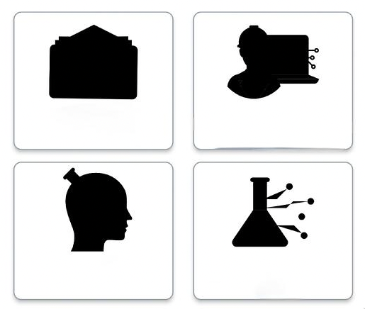

# Fix SVG Color Not Showing on Devices

SVG images may display properly on web preview but appear without color on physical mobile devices. This usually results from configuration or compatibility issues in the SVG file.

**Common Causes:**

   1. **Unsupported Color Mode**  
      Some mobile devices may not support CMYK color profiles. Ensure the SVG uses the `RGB` color mode.

   2. **Missing `fill` or `stroke` Attributes**  
      Open the SVG file in a text/code editor and verify that the appropriate `fill` or `stroke` attributes are defined for all elements.

   3. **Display Attribute Conflicts**  
      Elements in the SVG may be hidden using `display: none`. Remove or update this property if present.

   4. **Incorrect File Embedding**  
      Ensure the SVG file is correctly added to your FlutterFlow project's asset folder and that the file path is valid.

   5. **Device Accessibility Settings**  
      Some devices may have display filters or accessibility modes enabled that alter or suppress color rendering.

:::info[Prerequisites]
Ensure the SVG file is included in your **FlutterFlow project assets** and added via the **Image widget**.
:::

Follow the steps below to resolve the issue:

   1. **Test a Known Working SVG**  
      Use a sample SVG that has been tested to display correctly across devices. This can help isolate whether the issue is file-specific.

   2. **Export SVG with Simplified Settings**  
      Re-export the image using design tools like Figma, Illustrator, or SVGOMG, ensuring the export uses the RGB profile.

   3. **Open SVG in a Mobile Browser**  
      Upload the SVG to a hosting platform and open it directly in a mobile browser. This helps determine if the issue is related to rendering or Flutter integration.

   4. **Inspect SVG Attributes**  
      Open the SVG in a text editor and verify that all graphical elements include `fill` or `stroke` properties. Remove any `display: none;` styling if not needed.

   5. **Convert to PNG (if needed)**  
      If issues persist, consider converting the SVG to a PNG to ensure consistent cross-platform rendering.

:::tip
SVGs with simplified paths and explicit color attributes (`fill`, `stroke`) are more likely to display correctly across devices.
:::
