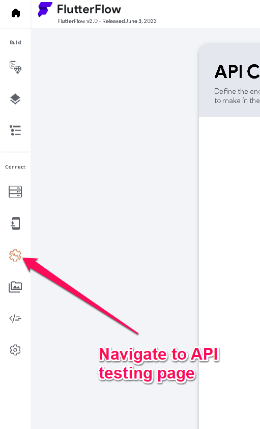
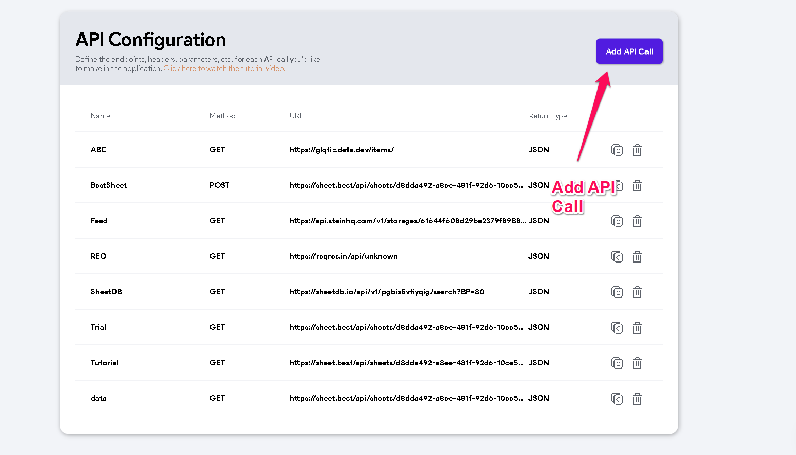
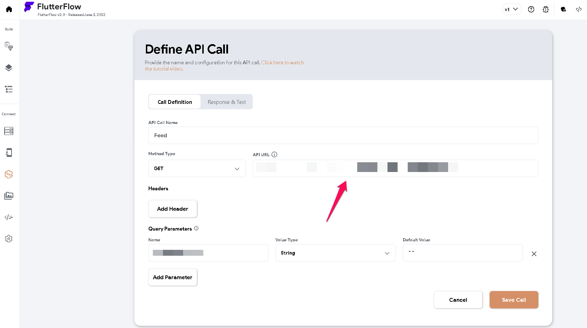
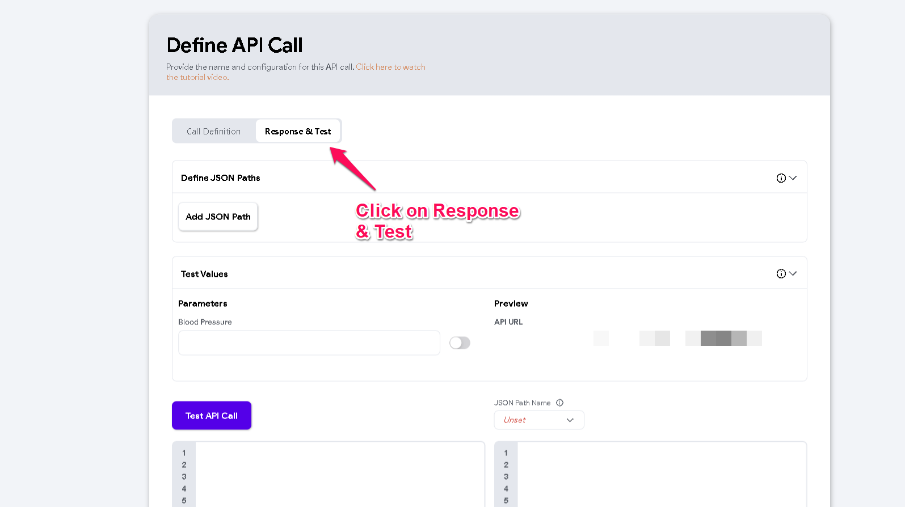
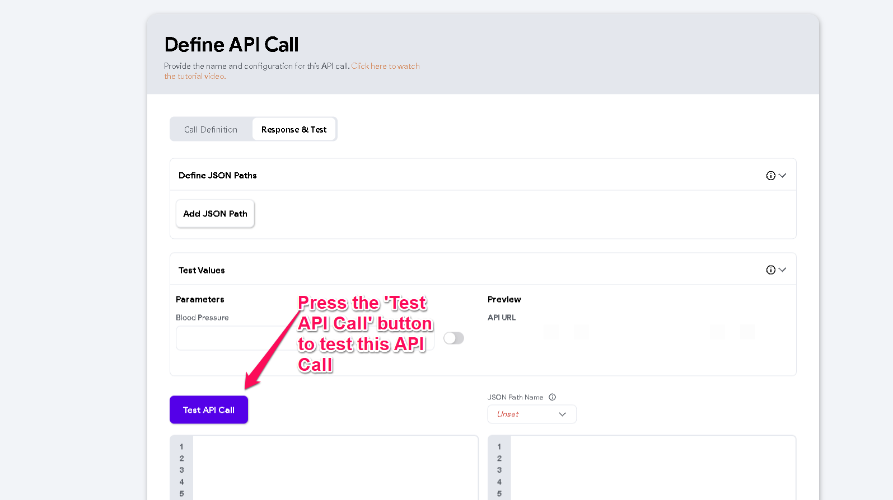
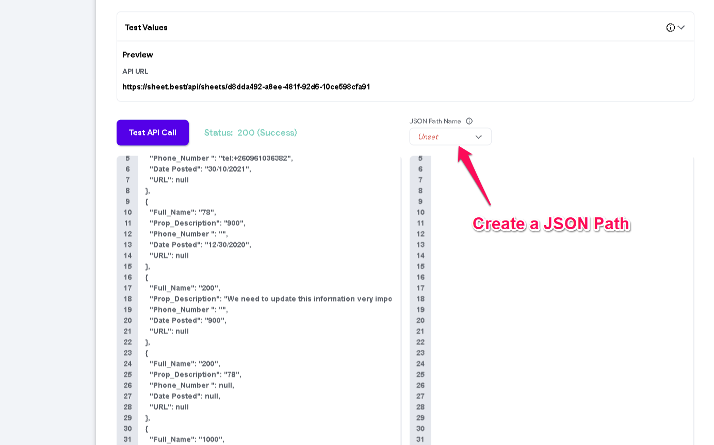

---
keywords:
  - apis
  - test-api
  - api-call
slug: /troubleshooting/test-mode/test-api-calls
title: Test API Calls
description: >-
  Verifying an API response before integrating it into your app helps prevent
  runtime issues and ensures your data is structured correctly.
tags:
  - FlutterFlow
  - Troubleshooting
  - Test Mode
last_verified: 2026-09-02
---
# Test API Calls

Verifying an API response before integrating it into your app helps prevent runtime issues and ensures your data is structured correctly. This guide walks you through testing an API directly within FlutterFlow.

:::info[Prerequisites]
- A project is open in FlutterFlow.
- An API key or endpoint is available if required by the API.
- Use test credentials and synthetic data. Never paste production secrets or personal data into a client-visible call or a screenshot.
:::

**Steps to Test API Calls:**

1. **Open the `API Calls` Panel**

   From the left sidebar, go to the `API Calls` section.

   

2. **Select or Create an API Call**

   Choose an existing `API Call` or click `+ Add API Call` to create a new one.

   

3. **Enter the API Endpoint**

   Add the endpoint and necessary parameters, headers, or authentication.

   

4. **Click the `Response & Test` Tab**

   Navigate to the `Response & Test` tab to preview the response structure.

   

5. **Run the API Test**

   Click the `Test API Call` button to trigger the request. If successful, the API response displays in JSON format.

   

   A valid API response displays a structured output like the example below::

   

:::tip
Use **[JSONPath](https://jsonpath.com/)** to validate and extract values from the returned JSON structure during testing.
Test documented non-2xx responses, empty/null fields, timeouts, pagination, and malformed payloads as well as the happy path. A successful test call does not prove the endpoint enforces authentication or authorization; private credentials and trusted validation belong on the server.
:::

## Related documentation

See [Black Screen During Run Mode](/troubleshooting/test-mode/black-screen-during-run-mode) for a related FlutterFlow workflow.
