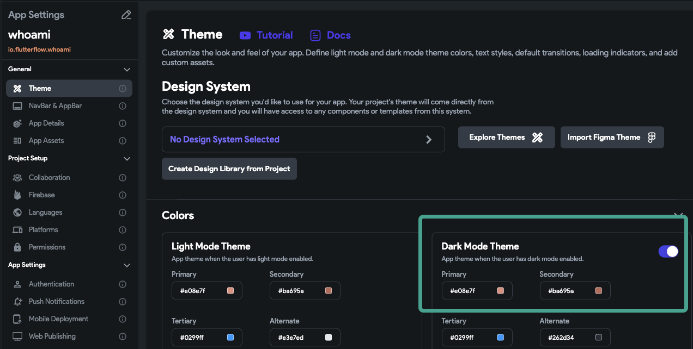
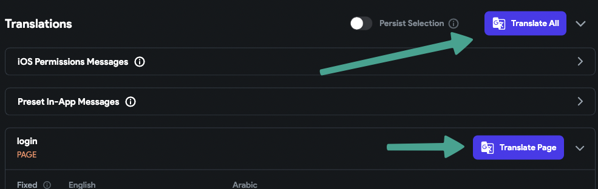
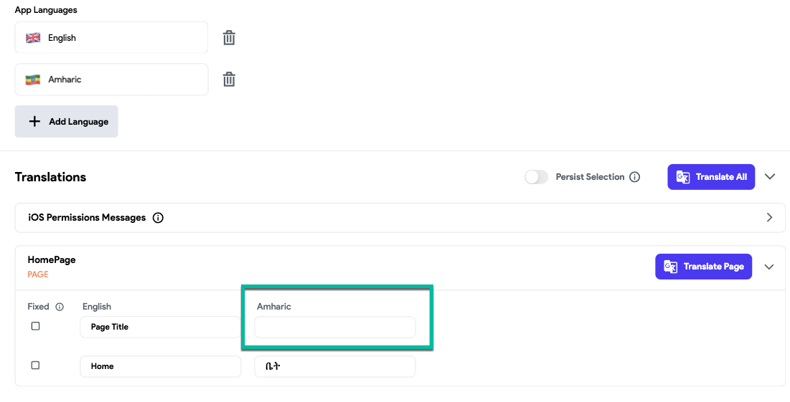

# Fix Text Not Showing on Mobile Devices

Text may appear normally during **Run/Test Mode** in FlutterFlow but fail to display when the app runs on a real mobile device. This issue is often caused by color contrast in dark mode or missing translations.

:::info[Prerequisites]
Make sure the **Text widget** is added to the correct screen and that it is not conditionally hidden using visibility settings.
:::

Follow the steps below to resolve this issue:

    1. **Check Dark Mode Contrast**  
    Text may be visible in light mode but blend into the background in dark mode due to incompatible colors.

    - Go to **Settings > Theme > Colors**.
    - Review and update your dark mode text colors for visibility.
    - Optionally, disable dark mode entirely for simpler behavior.

        

    :::warning
    Using black text (`#000000`) on dark mode backgrounds can render text invisible on devices.
    :::

    2. **Check for Missing Translations**  
    If your app uses localization, untranslated fields may render as blank on devices with alternate system languages.

    - Go to **Settings > Localization**.
    - Use the automatic translator or manually fill in missing entries for each language.

    
    
    

    3. **Preview Using a Real Device**  
    Always test using the **FlutterFlow Preview App** or deployed builds to check how your design renders on physical devices.

:::tip
- Avoid hardcoding text color to `white` or `black`. Use theme-based color variables when possible.
- Enable debug mode or use print statements to verify that the text content is being passed correctly.
- Review widget visibility rules and any dynamic conditions applied to the text.
:::
