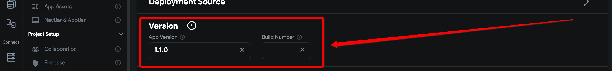

# APK specifies a version code that has already been used.

Full Error Message
```
Publishing failed :|Google Play failed to upload artefacts. APK specifies a version code that has already been used.: {"error": {"code": 403,"message": "APK specifies a version code that has already been used.","status": "PERMISSION_DENIED"}}
```
​**What Does This Error Mean?**
The version of the application published conflicts with an earlier version that was already published and will need to be updated​​**How do I Resolve This Issue?**

**When Deploying Directly From FlutterFlow. **
Navigate to the **Settings And Integrations &gt; Mobile deployment. **​

**App Version**: This refers to the version that the application will be set to. Setting a version number is optional, but may be required for specified cases. 
​**Build Number**: The build number is used for deployment. Each time it is successfully deployed this should increase by 1 until a new version is set (at which point it will be reset to 1)
If left empty, it will automatically increment the build number each time it is deployed. ​​**After incrementing the app version and build number from the previous one, you can deploy it once more.**​​**2. Deploying From GitHub **
Step 1: Open the `pubspec.yaml` file.
Step 2: Locate the **`version`** tag.
Step 3: Update the build name and number such as  `version: ^1.0.2+2`.NB: Use the latest Flutter `version `package
Step 4: Open the terminal and hit the **`flutter clean`** command.
Step 5: Build the app.

**The Issue Is Not Resolved**
If this issue is not resolved, `please contact support@flutterflow.io`

​