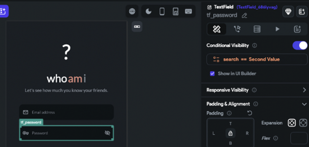

# Build Failed: Error loading project for test or run mode.

Issue
You receive this error when you try to create a new build in Run or Test mode, but you don't have any identified issues in your FlutterFlow project.​
**What does this error mean?**
There is an issue in your FlutterFlow project that is stopping your code from compiling. 

We typically try to notify you of potential project issues using the debug menu (example below). However, sometimes there are new error types that our system does not catch.

https://downloads.intercomcdn.com/i/o/684852344/3789bec88e632c06739287a4/image.png"/&gt;Example Issues That Can Cause A Build Failure

copy/paste a widget with lots of actions and visibility rules on it

copy/paste a widget with animations and animation actions on it

copy/paste a whole page or component

select a wrong data source that doesn't exist at the time of build, for example, you do a condition on a periodic action on a page load when the periodic is not exist yet.

Flutterflow Bug, It may be a bug and you need to report it in our github issue tracker if you find it.

Troubleshooting This Error Type

If you have the ability to download your code,  run the code in your local machine. You can check the last code and see the error in the code. With this information, you can return to the FlutterFlow editor and fix the issue.

You can also review your previous snapshots to identify the changes made that caused the error. For example, if the last thing you did was duplicate the page bookings and change some of it.Go to that page, check all the actions, Visibility rules, and open them one by one to find a red noticed item there.**Example of how an error could be hidden:**

Here in this visibility rule, you can't see any error. but let's see after opening the condition what we could see

You could see after opening the second value, we could see it's unset and red. Simply it could cause a build failure when we run the project.​
If with all above attempts the issue persists, Then please reach to the support@flutterflow.io.