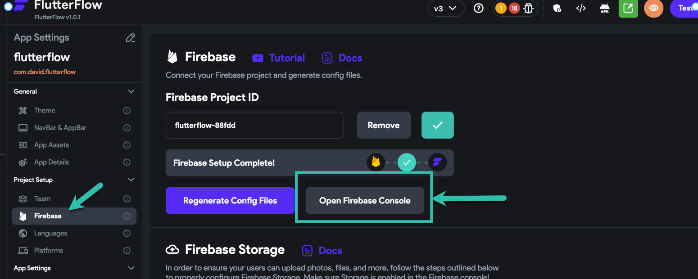
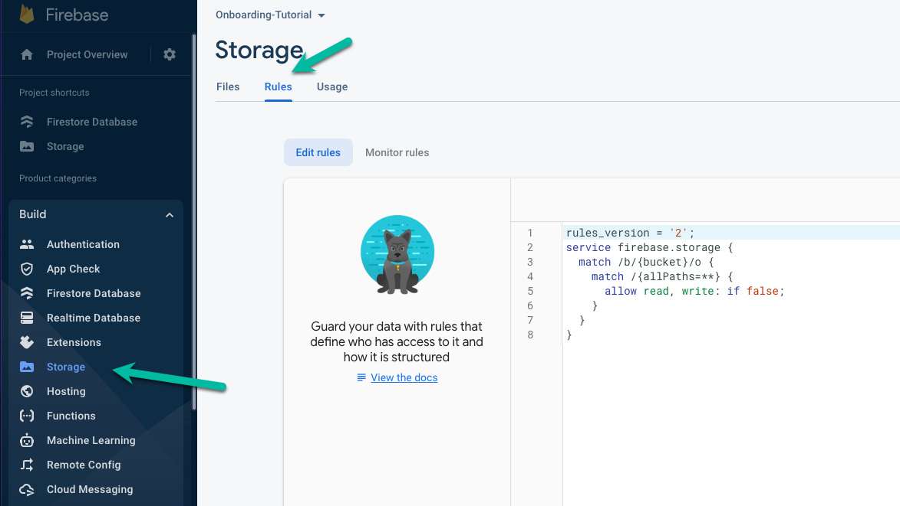

# Can't upload photo to Content Manager

Our default rules don't allow for upload in CMS. In order to do this, you will need to update your Firestore Rules.

Open your FlutterFlow project and click Settings &amp; Integrations &gt; Firebase &gt; Open Firebase Console



Next click Storage &gt; Rules



Replace the code with the following and then click **publish**:

```js
rules_version = '2';
service firebase.storage {
  match /b/{bucket}/o {
    match /{allPaths=**} {
      allow read, write: if request.auth != null;
    }
  }
}
```

**Important:** We recommend reviewing your Firebase rules before deploying your app. Please see this link for additional information on Firestore security rules.