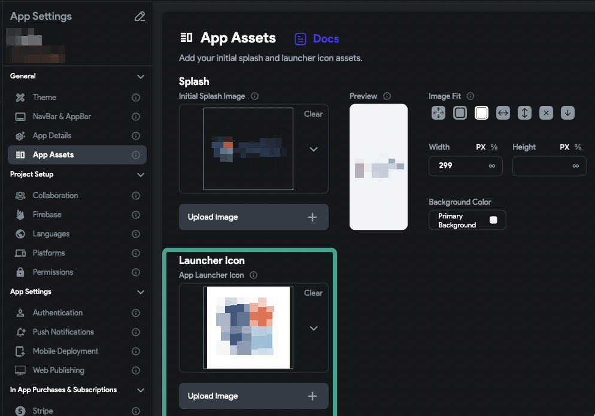

# Deployment/Build for mobile error: NoDecoderForImageFormatException

The issue is your icon file, the builder can not make the icon launcher file from your icon file selected.It could be the file format, For example, if you selected an SVG file for your icon.​
Go to the Setting/App assets and change the icon and splash image**Make sure **1- The size of the asset you selected is not too big 2- Select a PNG/JPEG file icon, not SVG or something else​
Try to use a 1024x1024 pixel size icon for the size at least.Note: Because Flutterflow uses the same icon asset to generate the ios and android icons, it is important that the asset you selected meets the guide lines of the two devices.For example, for ios better, you don't use PNG assets with transparent parts in it.Useful links:https://developer.android.com/distribute/google-play/resources/icon-design-specificationshttps://developer.apple.com/design/human-interface-guidelines/foundations/app-icons/