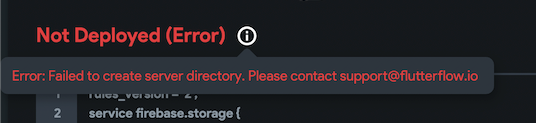
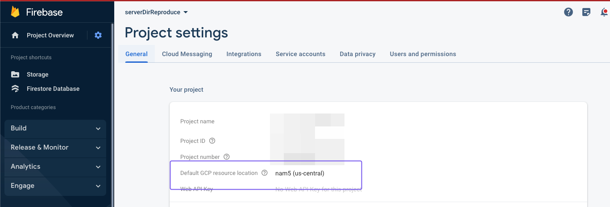
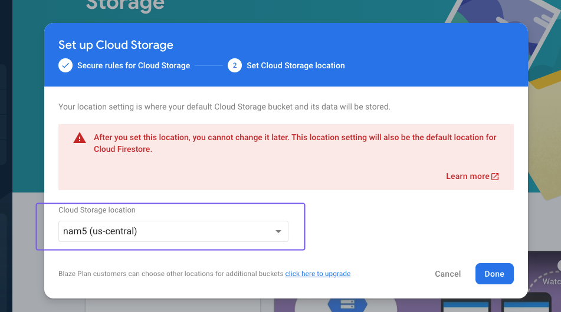
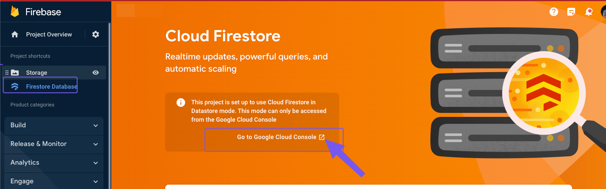
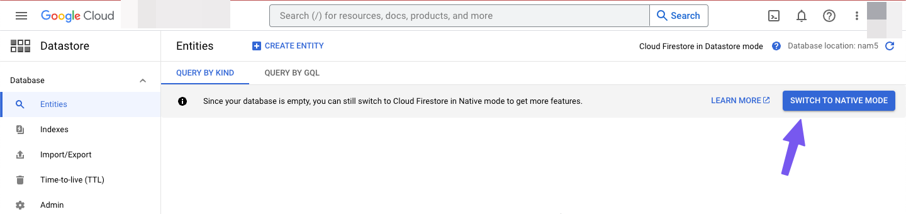
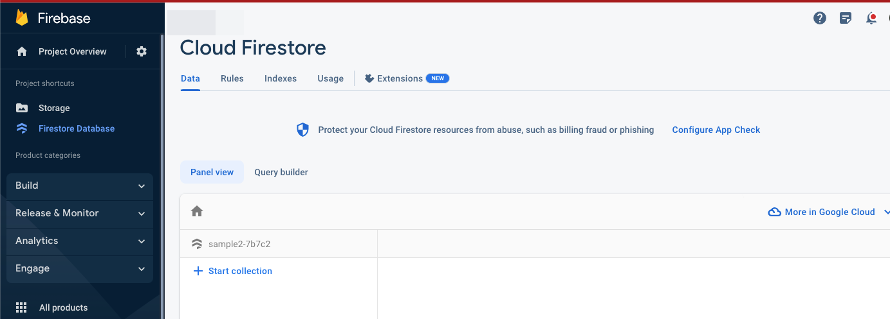
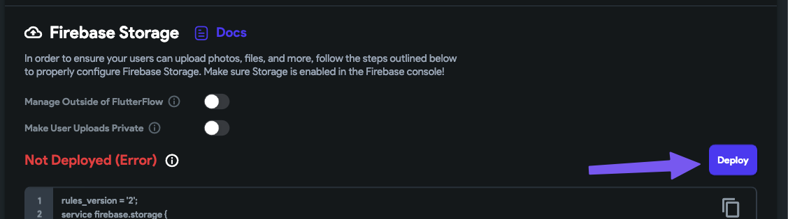
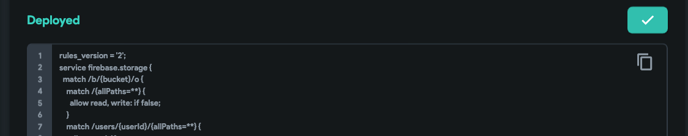

# Error: Failed to create server directory. Please contact support@flutterflow.io

**Background**

When trying to deploy Firebase storage rules, you might encounter `Error: Failed to create server directory. Please contact support@flutterflow.io`. This error can occur even after you have enabled Firebase storage in your Firebase Project linked to your FlutterFlow Project. This is likely because you have not set up Cloud Firestore correctly in your Firebase Project.

**How to resolve this issue?**
Step 1: Set Default GCP Resource Location. 
Open your Firebase project and navigate to project settings, then set `Default CGP resource location` to the region that you prefer.

Step 2: Enable Firebase Storage 
In your Firebase project, navigate to the Build section and select Storage. Click get started and then set the rules to testing. In the location segment, set the same location as the one in the project settings. 

Step 3: Enable Cloud Firestore
In your Firebase project, navigate to the Build section and select Firestore Database. In some cases, cloud firebase is set to Data Store Mode, which is not recommended when working with FlutterFlow, so you will need to change Cloud Firestore from Data Store Mode to Native Mode.

Change to Cloud Firestore to Native Mode

Click on `Go to Google Cloud Console`

Click `Switch To Native Mode`

After switching the mode, navigate back to Firebase and reload Cloud Firestore.

Step 4: Deploy Firebase Storage Rules in FlutterFlow  
Open your FlutterFlow Project and re-deploy Firebase Storage Rules.

**The issue was not resolved.**
If the error still persists after following the outlined steps, please contact support via Chat or Email at support@flutterflow.io.