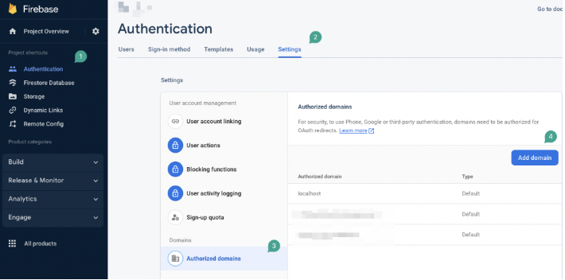
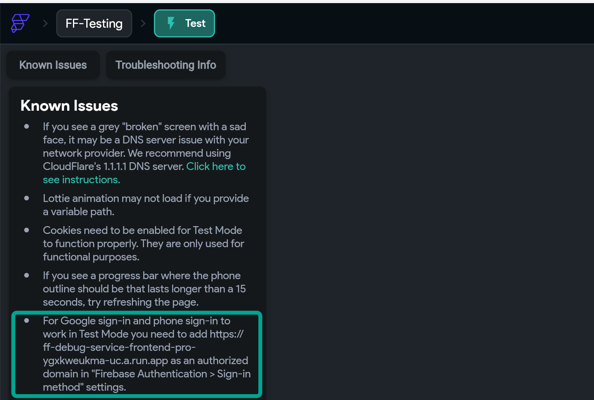

# Google Sign-In Doesn't Work In Run/Test Mode And Published Web application on web

​If you want to use social login features such as Google sign-in, Facebook, Microsoft, etc. on RUN or TEST mode or for your published web application, you need to add your domain to Firebase Authentication/Authorized Domain.

By doing this, you will whitelist your domain for Firebase authentication and give permission to the social login performed from the domain as an origin.
Here are the steps to follow:

Open your Firebase project.

Go to Authentication &gt; Settings.

Select Authorized Domains.

You should now see a list of domains that are already authorized. To add your domain, click on the Add Domain button.​
For instance, if you want to use social login in RUN mode in Flutterflow builds, you can whitelist this domain: app.flutterflow.io. If you published your app to **yourapp.flutterflow.app**, you need to add the same URL to your Authorized domains.
Side note: Specifically for the Test mode, you need to add our debug session URL to your authorized domains as well, as we explained here in test mode in the known issues panel.You can copy the URL from the known issues menu.

