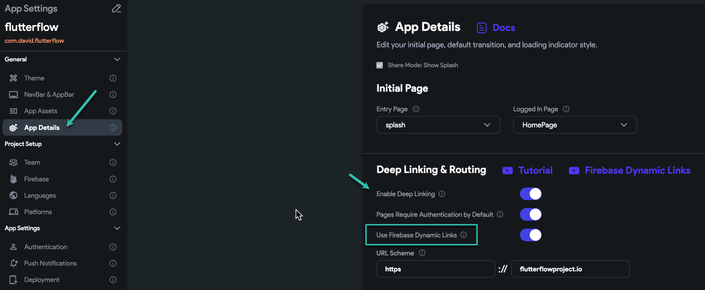
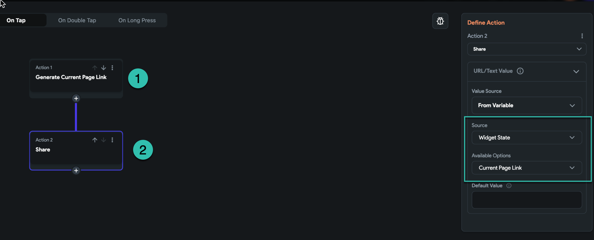

# How can i access to Page link [ after activating the dynamic link ]

**After you enabled the deep linking &amp; Routing**​
You can also turn on Firebase dynamic links.
Want o know more about firebase dynamic links?

Now when you **activated dynamic links**, you have access to the **page link** [ a specific link for each page ]​
**Notice**: if you enable dynamic link you need to pu "HTTPS" for URL scheme How to setup dynamic link

**Next step:**
Access the page link

**when you want to use the page URL:**
In this example, we want to share the page URL,  you need to first add an action [ Generate current page link }

then after that, you can access the page URL throw the **widget state**/**Current page link**

in this example I add 2 actions on my share button:

**Generate the current page link action**

**Share action: I select widget state/ current page link as the source of my action**

