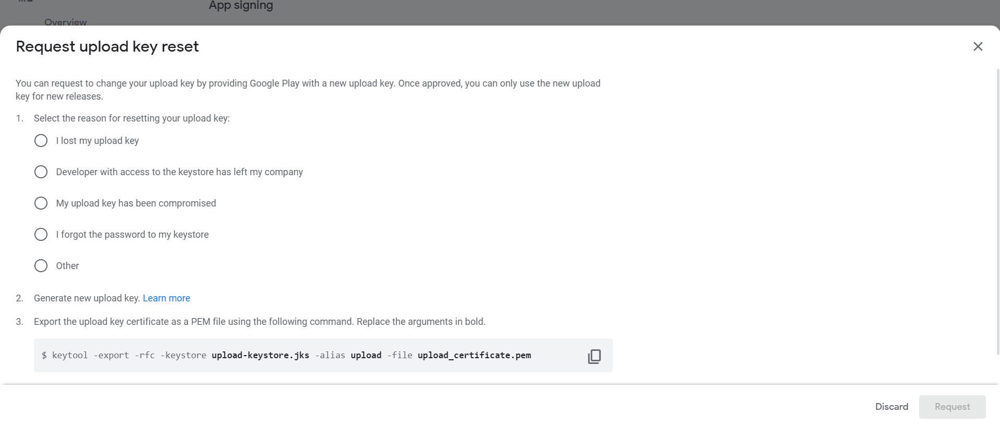
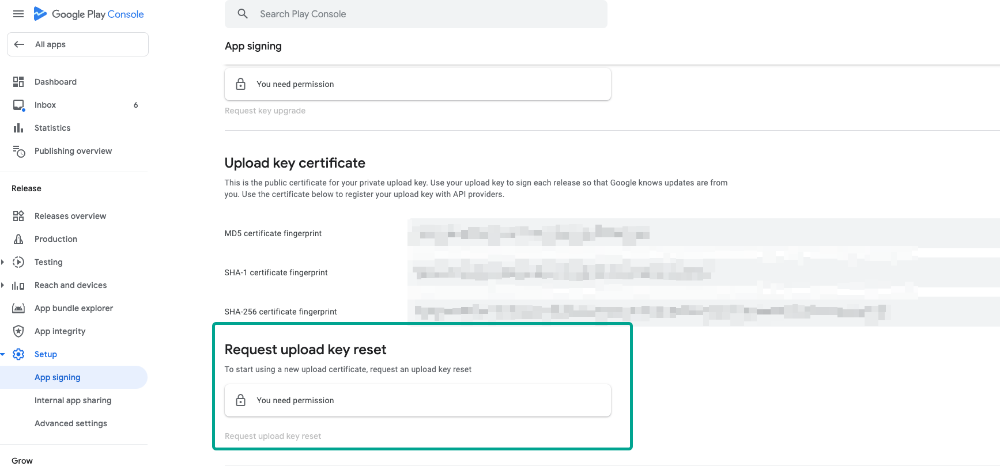
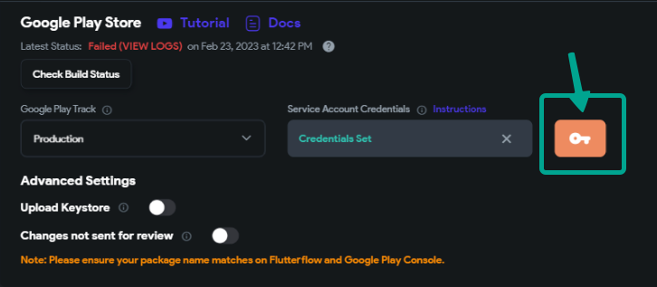

# How to Retrieve and Upload Your Keystore File in FlutterFlow for an Existing Google Play Project

Introduction
Publishing an updated version of your app using FlutterFlow can be a challenging task, especially when the app was initially published on Google Play using another platform. 

This guide aims to walk you through the process of obtaining or resetting keys from Google Play, creating a new keystore on your local machine, uploading it to FlutterFlow, and successfully deploying the app to your existing Google Play project.

If you run into any roadblocks, we recommend reaching out to Google Play support or FlutterFlow Support for further assistance.


Create the new keystorekeytool -genkeypair -alias allyou -keyalg RSA -keysize 2048 -validity 10000 -keystore allyou.keystoreExport the pem public key from itkeytool -export -rfc -lkeystore allyou.keystore -alias allyou -file allyou.pem Provide it to the google play requestWait for them to approveThen next steps is to use the keystore to deploy to google play

Step 1: Create a New Keystore

Begin by generating a new keystore. Open your command line tool and enter the following command:
```
bashCopy codekeytool -genkeypair -alias allyou -keyalg RSA -keysize 2048 -validity 10000 -keystore allyou.keystore
```
This command creates a new keystore named 'allyou.keystore' with an RSA key pair, a key size of 2048 bits, and a validity period of 10,000 days. The alias for your key should be 'allyou'.
Step 2: Export the PEM Public Key

Once your keystore is created, you need to export the public key. Use the following command to do so:
```
bashCopy codekeytool -export -rfc -keystore allyou.keystore -alias allyou -file allyou.pem
```
This command exports the public key into a file named 'allyou.pem'. Ensure you have access to the keystore ('allyou.keystore') as it is required for this step.
Step 3: Provide the PEM Public Key to Google Play

After exporting the PEM public key, you need to provide it to Google Play. Log in to your Google Play Console and follow the necessary steps to submit your 'allyou.pem' file. This process is typically required for app signing or other verification purposes.
Step 4: Wait for Approval from Google Play

After submitting your PEM public key, wait for approval from Google Play. This process can vary in time, so check your Google Play Console regularly for updates. Approval is necessary before you can proceed with deploying your app.
Step 3: Deploy to Google Play Using the Keystore

Once your PEM public key is approved, you can use your keystore ('allyou.keystore') to deploy your app to Google Play. 

Proceed with the app upload process in the Google Play Console, ensuring that you select the 'allyou.keystore' file when prompted for your keystore details.

------Step 1: Requesting a New Upload Key from Google Play (If Necessary)
If you've lost your original upload key, or it has been compromised, you can request a new one from Google Play. Here's how:

Sign in to your Google Play Console.

Select the app you want to manage.

On the left menu, click on "Setup" and then "App Integrity."

Look for the "Request upload key reset" option.

Note: If you can't find the app integrity you can use the search bar on top of the Google Play console​


**Note**: You'll see a lock icon next to this option, indicating that you need special permission to perform this action. If you don't have the necessary permission, you will need to get it from the account owner.

Follow the on-screen instructions to complete the request.
This process will generate a new upload key for you, but remember, it takes about 48 hours for the new key to become available for use.​
**Important**: Keep this new key safe and back it up immediately. Losing your upload key can severely complicate the app update process on Google Play.​
​
Step 2: After Receiving the New Upload Key

Once Google Play has approved your request and provided you with a new upload key, you'll typically receive it in a **`.jks`** or **`.p12`** format. Here's what to do next:
​**Verify the Key**: Open a terminal and use the following command to list the key's details:​
```
keytool -list -v -keystore path/to/your_new_key.jks
```
Replace **`path/to/your_new_key.jks`** with the actual path to your new key. This command will display the key's fingerprint, which should match the one provided by Google Play.
​**Prepare for FlutterFlow**: Make sure the key is in **`.jks`** format as FlutterFlow requires this specific type. If your key is in **`.p12`** format, you can convert it using:​
```
keytool -importkeystore -srckeystore your-key.p12 -srcstoretype pkcs12 -destkeystore your-key.jks -deststoretype JKS
```
​**Upload to FlutterFlow**: Log in to your FlutterFlow account, go to the 'Deploy' section, and upload the new **`.jks`** key under Android settings. Make sure to input the keystore password, key alias, and key password that are associated with the new key.​

**Deploying to the Google Play Store:** Before deploying your app to Google Play, consider running a test build within FlutterFlow using the newly uploaded key. This will help you identify any issues before the final deployment.
​Note: Your key store file Flutterflow used to sign your app, is accessible on the deploy page with the orange key button.​


Conclusion
We hope this guide assists you in deploying your app using FlutterFlow. Managing keystores is an essential part of app development. Always back up your keystore and remember the passwords you set for it. A lost keystore can create severe complications for your app's updates on Google Play.​
For further assistance, feel free to contact FlutterFlow Support or Google Play Support.