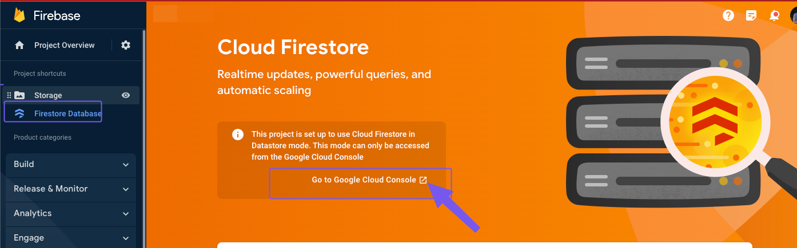
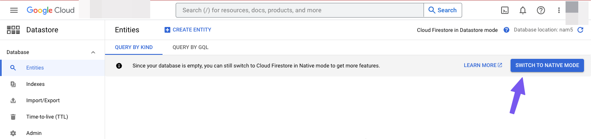
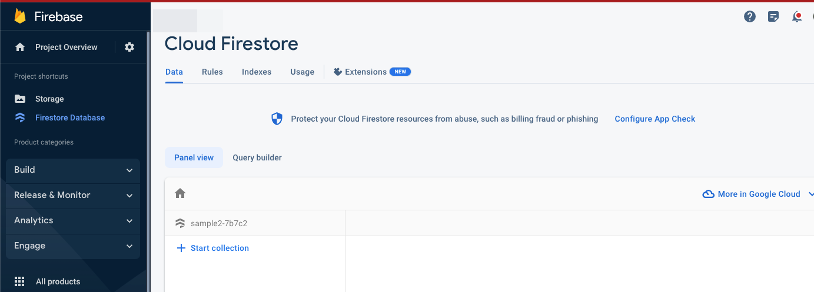

# How to change modes in Firestore; from Datastore to Native mode

**Background**In some cases,  Cloud Firestore is set to Data Store Mode by default, which is not recommended when working with FlutterFlow.In this case, you will need to change Cloud Firestore from Data Store Mode to Native Mode.​
Steps To ChangeCloud Firestore to Native Mode

Click on `Go to Google Cloud Console`

Click `Switch To Native Mode`

After switching the mode, navigate back to Firebase and reload Cloud Firestore.

- 
If the error still persists after following the outlined steps, please contact support via Chat or Email at support@flutterflow.io.