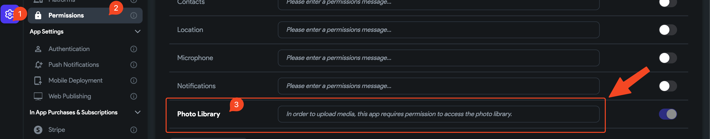
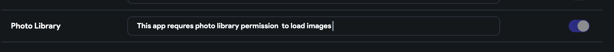

# ITMS-90683: Missing purpose string in Info.plist - The Info.plist file for the “Runner.app” bundle should contain a NSPhotoLibraryUsageDescription key

**Full Error Message**`Dear Developer,`
`We identified one or more issues with a recent delivery for your app, "Gral Wind Orchestra App" 1.0.1 (1). Please correct the following issues, then upload again.`
`ITMS-90683: Missing purpose string in Info.plist - Your app’s code references one or more APIs that access sensitive user data, or the app has one or more entitlements that permit such access. The Info.plist file for the “Runner.app” bundle should contain a NSPhotoLibraryUsageDescription key with a user-facing purpose string explaining clearly and completely why your app needs the data. If your app supports multiple locales, you’re now required to provide a purpose string value in the Info.plist file in addition to a valid localized string across each of your app’s localization folders. If you’re using external libraries or SDKs, they may reference APIs that require a purpose string. While your app might not use these APIs, a purpose string is still required. For details, visit: https://developer.apple.com/documentation/uikit/protecting_the_user_s_privacy/requesting_access_to_protected_resources.`

Background
This error occurs when you have not provided a permission usage description for the requested permission.

**How To Resolve This Issue?**

Navigate to `Settings and Intergrations`

Scroll to `Project setup` and click `Permissions`

Locate the permission requested without a usage description and add the description.

**The issue was not resolved.**

If the error persists after following the outlined steps, please report this issue to support via Chat or Email at support@flutterflow.io.

​