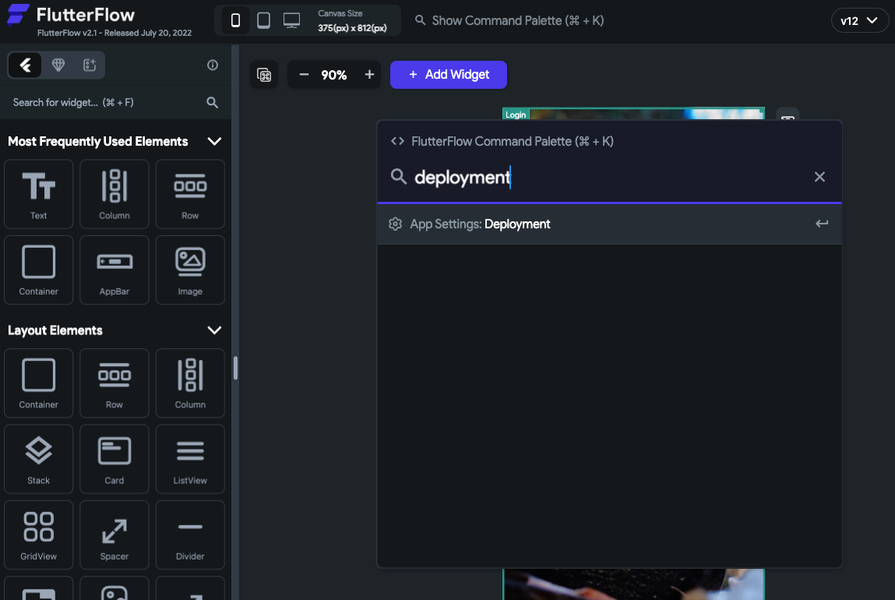
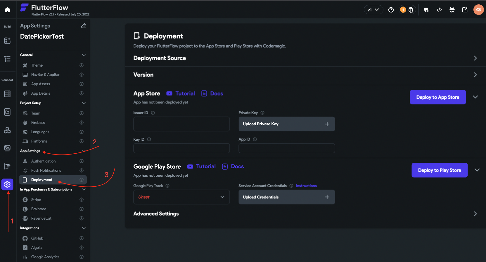

# Invalid Pre-Release Train. The train version 'X.X.X' is closed for new build submissions

Tip: Not sure which type of error your project has? Check out this article on how to identify your Codemagic error.

**What does this error mean?**
This error means that the app that you're trying to submit to the App Store is closed for new build submissions. You can't submit it again with the same app version, even if the build number has changed.

**How to resolve this issue?**
You'll need to increment the app version in the FlutterFlow deployment settings.
In order to do this, please follow these steps:

Press **Cmd/Ctrl + k**, type **"deployment"** and hit enter. It will take you to the deployment page.

You can also navigate to the Deployment section by clicking **Project Settings** > **Deployment** (under App Settings).​

Click on the Expand icon in front of the **Version.**

Here you'll need to update the version number to the next increment version number. For example, if you have 1.2.0, you will need to upgrade to 1.2.1
***Learn more about when to increment version numbers after the 4th step.***

After this, you can try deploying your app once again, and it will succeed.

When to increment the app version number?
The best versioning scheme is to choose what makes sense to you or your team. But here's a common versioning method called **Semantic Versioning (Major.Minor.Build)**

Major Version
The first number in the sequence `(1.x.x)` is the major version and this semantically means that the software has a breaking change that could affect any other software that depends on it. For example, you could have an API that completely changes the URI path in an upgraded version from `1.x.x` to `2.x.x`.

Minor Version
Minor versions are changes to the code that do not reflect breaking changes but are significant enough to warrant a version increase. More often than not, this includes additions to the code that add functionality and does not break it. So if you added a new endpoint to an existing API and kept all other endpoints the same, then the API's version could be increased from `x.1.x` to `x.2.x`.

Bug/Build Version
The last number in the scheme stands for the bug/build version depending on how you want to look at it. This could be used for bug fixes and hotfixes that come up in the lifecycle of your application. For example, `x.x.1` to `x.x.2`.