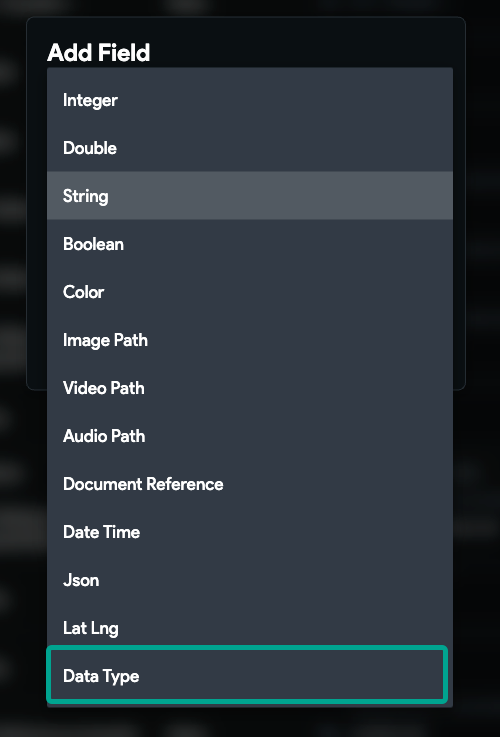

# Missing Data Types in App State Variable List

Under normal circumstances, when you're creating an app state variable in FlutterFlow, you should be able to see the data type as an option. However, there may be instances where this option is not visible. **This can be particularly prevalent in older projects.**

The root cause of this issue often lies in the Deep Linking settings of your project. If Deep Linking is not enabled, the data types may not appear in the app state variable creation list.

To resolve this issue, follow the steps outlined below:

1. Navigate to your FlutterFlow project settings page.
2. Locate the 'App Details' section.
3. Within this section, find the 'Deep Linking &amp; Route' settings.
**4. Ensure that the Deep Linking option is turned on.**

**Conclusion**:
By following these steps, you should now be able to see the data types when creating an app state variable in FlutterFlow. This simple yet effective solution ensures that your app development process remains smooth and efficient.

Remember, troubleshooting is an integral part of the development process. Stay patient, stay persistent, and happy coding!

Please note: This solution is particularly effective for older projects. If you're still facing issues after implementing these steps, please reach out to FlutterFlow support for further assistance.

