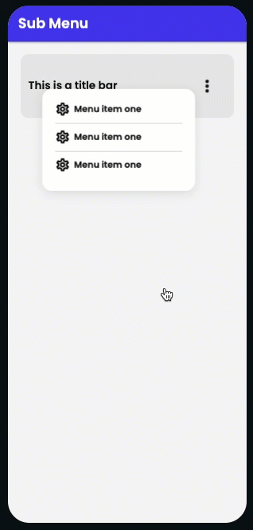

# Project Sample : How to Create a sub menu

Project URL: **https://app.flutterflow.io/project/sub-menu-840l5q**Run mode URL: **https://app.flutterflow.io/run/LfzBGTaef8WldndHa2x4**

We need a local state variable type boolean to keep the active state of the menu

True means the menu is open and False means the menu is close now

Make sure you place the menu in the right place, based on your need

Put the visibility rule on the menu, the local state variable we made before

**We need to put the open/close actions for the menu in three different places**

1- menu icon button: open and close the menu
in this action, we check the menu local state variable and if it is false we make it true and if it is true make it false

2- menu items: on each item on the menu, when actions are finished in the end we need to change the local state variable of the menu to false to close the menu

3- on the page body [ the main widget on the page ] we need to close the menu in tap for the body of the page, why? because we want to close this menu when the user clicks anywhere on the page.
Now we put the local state variable as a visibility rule on the menu, it means when that variable is true show the menu and when it is false hide it.Notice: We need to use the Stack widget, so we can place widgets on top of each other. so based on your need and your UI first of all you need to make the sub-menu and put it in the right place.

