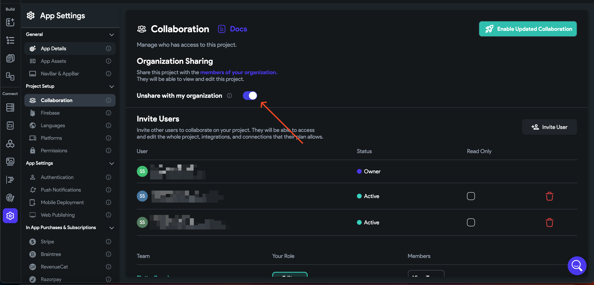
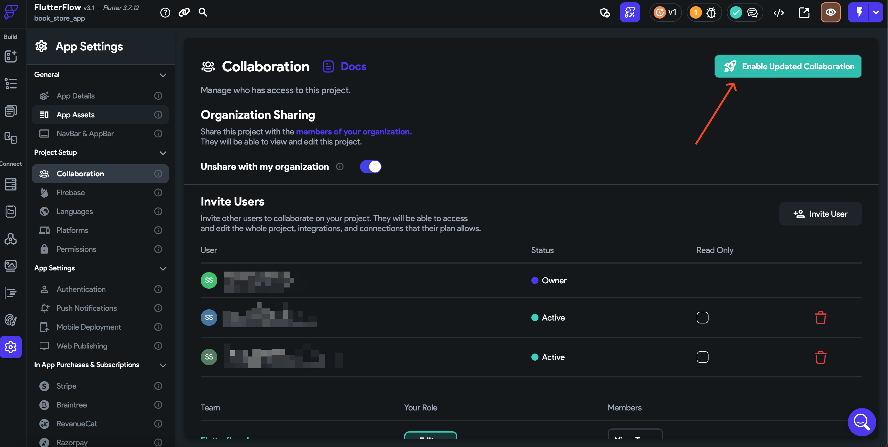

# Project in use/Enable Realtime Collaboration

**Error Message:**
**Background:**This error appears when the user has not shared the project with the organization**Solution**Head over to the Collaboration settings of the project and turn on the "**Share with my organization"** option.​
Additionally, Now that you have shared it with the organization if you want to enable **"updated real-time collaboration"**, Click on this button and enable real-time Collaboration for your project.​
After implementing this solution, your team members will be able to make changes to your project in real-time.**The issue was not resolved**
If the error persists after following the outlined steps, please report this issue to support via Chat or Email at support@flutterflow.io.​