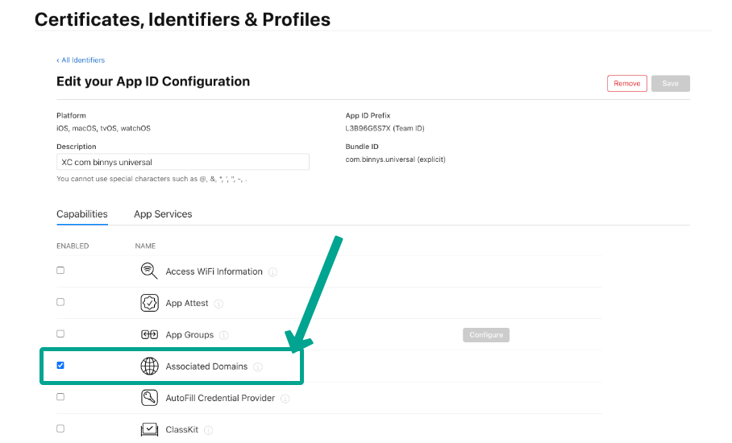

# Provisioning profile [app store project ID] doesn't support the Associated Domains capability.

When deploying an app through FlutterFlow to the Apple App Store, developers might encounter a specific error regarding the 'Associated Domains' capability. This article aims to clarify this issue, explaining its cause and guiding you through the process of enabling this capability within your Apple Developer account to ensure smooth app functionality.​
**The Root of the Problem**
The error message 'Provisioning profile [app store project ID] doesn't support the Associated Domains capability' occurs when an app submitted to the App Store lacks the proper configuration for the Associated Domains. This capability is essential for apps that need to verify domain ownership and set up app-to-site associations, which are critical for features like Universal Links, App Clips, and website authentication.
Enabling 'Associated Domains' Capability​​**Example: You will face this error when you use dynamic links in your projects.**​
To resolve this issue and enable the 'Associated Domains' capability for your app, follow these steps:

**Visit Your Apple Developer Account**: Sign in to your Apple Developer account and navigate to the 'Identifiers' section found under 'Certificates, Identifiers &amp; Profiles'.​

​

**Select Your App's Identifier**: Locate the App ID for the app you're deploying. It's essential since the capability adjustments are specific to your app's identifier.

**Enable the Capability**: In your app's identifier details, find the section for enabling capabilities. Select the option for 'Associated Domains'. This step does not require altering the primary App ID or creating a new key if it's the first time you're enabling this capability for an App ID.​

​

**Save Changes**: After enabling the 'Associated Domains' capability, ensure you save the changes. Unlike some UI elements that might suggest further editing, enabling the feature and saving should be sufficient for the initial setup.​

**Deploy Through FlutterFlow**: With the 'Associated Domains' capability now enabled for your App ID, you can proceed to deploy your app via FlutterFlow.​

Understanding Your Developer Account's Capabilities
​**What does this error mean?**
The provisioning profile error indicates that the domain linked to the developer account is unsupported due to the user's subscription status. This often occurs when the user is not subscribed to a paid Apple Developer account plan.
​**Full error message**
'Provisioning profile [app store project ID] doesn't support the Associated Domains capability.'​
**How can I resolve this issue?**

**Verify Your Apple Developer Account Subscription Status**: Ensure that your account type supports the 'Associated Domains' capability, which requires a paid plan.
​**How can I view my subscription status?**
To check your Apple Developer subscription status, log into your Apple Developer account. Your account information, including subscription status, will be displayed on the dashboard, with active subscriptions marked as 'Current'. If your subscription is nearing its expiration, the 'Expiration Date' will be visible, allowing you to plan for renewal. For further assistance, contact Apple Developer support at devsupport@apple.com.​