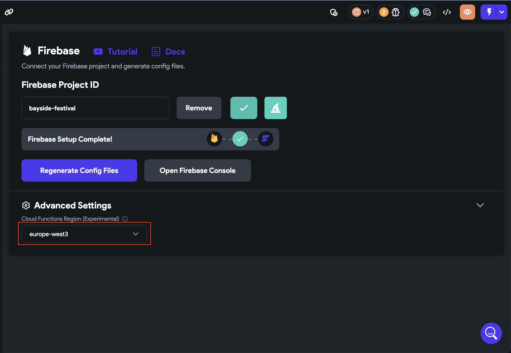

# Stripe payment action error: Unknown Error Occurred

**Error Details:**Snackbar: Unknown Error Occurred**Console:**
Access to fetch at 'https://us-central1-bayside-festival.cloudfunctions.net/initStripeTestPayment' from origin 'https://ff-debug-service-frontend-ygxkweukma-uc.a.run.app' has been blocked by CORS policy: Response to preflight request doesn't pass access control check: Redirect is not allowed for a preflight request.**Why this Error is caused:**The Cloud function region is different comparing to the region defined in Firebase.**How to Resolve this Error:**
Step 1: Head over to the firebase in the settings page **(You can also do this from command palette with keys ⌘+K or Ctrl+K and write firebase)**, Show Advanced settings, Here you will see the Cloud Functions Regions dropdown. 
Step 2: Set the Cloud functions Region to [Default] or a region defined in firebase.​
Step 3: Delete the already deployed functions from firebase.​
Step 4: Re-Deploy Stripe in your project​
After these steps, your problem should be resolved, if the problem still persists feel free to contact us at support@flutterflow.io​
