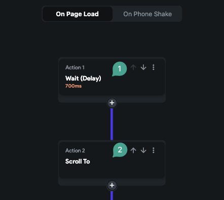
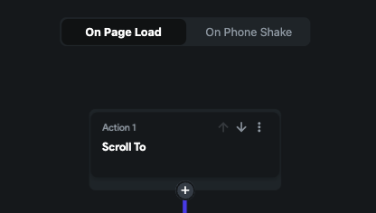

---
keywords:
  - scroll to action
  - page load
  - delay
  - animation
slug: /troubleshooting/widget/scroll-to-action-on-page-load
title: Scroll To Action on Page Load
description: >-
  When a fails to trigger during a page load, it is often because the scrollable
  widget has not fully rendered at the time the action executes.
tags:
  - FlutterFlow
  - Troubleshooting
  - Widget
last_verified: 2026-09-02
---
# Scroll To Action on Page Load

When a `Scroll To Action` fails to trigger during a page load, it is often because the scrollable widget has not fully rendered at the time the action executes. This guide outlines how to ensure the scroll action works reliably during page load.

:::info[Prerequisites]
- The `Scroll To Action` is configured inside an `On Page Load` action flow.
- The target widget is inside a scrollable view such as `ListView` or `Column`.
:::

## Steps to Ensure Reliable Scroll Behavior:

1. **Add a Delay Before the Scroll Action**
   As a diagnostic workaround, insert a short `Delay Action` before `Scroll To`. A fixed delay can still fail on slow devices or delayed backend data, so use the smallest value that works across representative devices and treat it as a fallback rather than proof the target exists.

   

2. **Use Load Animations for Scrollable Widgets**
   A load animation can coordinate the visual transition, but it does not guarantee that asynchronously queried content or the target widget is ready.
   - Add a load animation (e.g., `Fade`) to the scrollable widget.
   - Set the animation duration to approximately `1200 ms`.
   - Add a `Delay Action` before the scroll action (e.g., `700 ms`).

   

   :::tip
   Test empty, cached, slow-network, and error states. If the target is data-dependent, trigger scrolling after that data and target are available when the action flow supports it.
   :::

## Related documentation

See [Custom Widget Errors](/troubleshooting/widget/custom-widget-errors) for a related FlutterFlow workflow.
