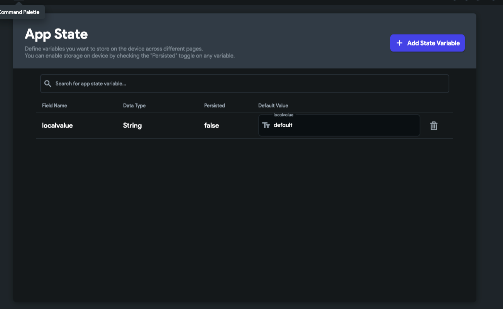

# Store Custom Widget Output Using App State

To use the output from a custom widget elsewhere in your project, you can store its value in an app state variable. FlutterFlow does not directly support retrieving data from custom widgets, so this method provides an effective workaround.

:::info[Prerequisites]
- You have created a custom widget in your project.
- You are familiar with the **[App State management](../../resources/data-representation/app-state)** system in FlutterFlow.
:::

## Steps to Store Output from a Custom Widget

1. **Create an App State Variable**  
   Go to **App State**, then create a new app state variable that will hold the value returned by your custom widget.

   

2. **Update the App State Variable from the Custom Widget**  
   In your custom widget code, use `FFAppState()` to set the value of the app state variable.

   ```js
   FFAppState().update(() {
     FFAppState().localvalue = 'setvalue';
   });
   ```

   App state variables can be accessed anywhere in your FlutterFlow project, making them useful for sharing data between custom widgets and other parts of the app.